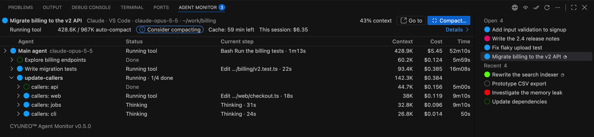

# CYUNEO Agent Monitor

[English](README.md) · [简体中文](README.zh-CN.md) · [繁體中文](README.zh-TW.md) · **한국어** · [日本語](README.ja.md)

터미널 바로 옆에서 모든 Claude Code와 Codex 채팅을 한눈에 확인하세요: 어떤 에이전트가 작업 중인지, 어떤 것이 확인을 기다리는지, 각 컨텍스트가 얼마나 찼는지.

[**VS Code에 설치**](https://vscode.dev/redirect?url=vscode:extension/cyuneo.cyuneo-agent-monitor) · [Visual Studio Marketplace에서 보기](https://marketplace.visualstudio.com/items?itemName=cyuneo.cyuneo-agent-monitor)

> **프리뷰(0.3.1).** 첫 공개 버전입니다. 이상한 점을 발견하면 [GitHub Issues](https://github.com/cyuneo/cyuneo-agent-monitor/issues)에 알려주세요.

## 왜 만들었나

Claude Code와 Codex는 이제 여러 에이전트를 동시에 실행합니다. 서브에이전트, 백그라운드 에이전트, 워크플로 전체까지요. 그런데 VS Code에서는 이 작업이 대부분 보이지 않습니다.

- **누가 무엇을 하는지 보이지 않습니다.** 에이전트 보기는 직접 열어야만 나타나서, 승인을 기다리는 에이전트가 아무도 모른 채 멈춰 있을 수 있습니다.
- **컨텍스트가 조용히 차오릅니다.** 자동 압축이 좋지 않은 순간에 갑자기 실행되거나, 긴 대화가 내용을 잊기 시작해야 알게 됩니다.
- **잠시 자리를 비우면 캐시가 만료됩니다.** 한 시간 뒤 돌아오면 다음 메시지가 전체 컨텍스트를 정가로 다시 읽습니다.
- **사용량 한도에 걸리면 작업이 중간에 멈춥니다.** 에이전트가 멈추면 직접 알아채고, 한도가 초기화되기를 기다렸다가, 손으로 다시 이어서 실행해야 합니다.

## 무엇을 해 주나

- **모든 채팅을 한눈에.** 터미널 옆 패널에 열려 있거나 최근에 사용한 모든 채팅이 상태등과 함께 표시됩니다. 하나를 클릭하면 그 안의 에이전트, 각 에이전트가 진행 중인 단계, 토큰과 비용을 볼 수 있습니다.
- **내가 필요할 때 바로 알 수 있습니다.** 승인이나 답변을 기다리는 채팅에는 마젠타색 등이 켜지고, 완료와 오류도 각각 다른 색으로 표시됩니다. 상태 표시줄에서도 보입니다.
- **컨텍스트를 관리합니다.** 채팅마다 컨텍스트가 얼마나 찼는지 보고, 패널에서 바로 압축하고(더 저렴한 모델도 선택 가능, 비용 추정을 먼저 확인), 자동 압축 시점을 직접 정하고, 캐시가 만료되기 전에 알림을 받습니다.
- **사용량 한도 이후에도 이어서 작업합니다.** 한도가 언제 초기화되는지 보여 주고, 다시 이어 갈 프롬프트나 명령을 준비해 두어 복사만 하면 됩니다.
- **채팅 기록이 어디에 저장되는지 알 수 있습니다.** 차지하는 공간을 보여 주고, 다른 디스크로 옮기는 참고용 명령도 제공합니다.

Claude Code와 Codex가 이미 컴퓨터에 기록해 둔 내용만 읽습니다. 확장 프로그램 자체는 네트워크에 접속하지 않고 어떤 데이터도 수집하지 않습니다.

## 시작하기

1. 위의 **VS Code에 설치**를 클릭하거나, 확장 프로그램 보기에서 **CYUNEO Agent Monitor**를 검색하세요.
2. 하단 패널에서 Terminal 옆의 **에이전트 모니터** 탭을 여세요.
3. 목록에서 채팅을 클릭하면 그 채팅의 에이전트가 보입니다.

모든 기능, 명령, 설정에 대한 자세한 설명은 **[전체 가이드](docs/GUIDE.ko.md)**를 참고하세요.

## 요구 사항

- VS Code 1.94 이상.
- 같은 컴퓨터에서 사용하는 Claude Code 그리고/또는 Codex(VS Code 확장 프로그램, 명령줄, 또는 데스크톱 앱).
- 닫힌 채팅을 백그라운드에서 압축하려면 Claude Code 명령줄도 필요합니다. 확장 프로그램은 PATH에서 `claude`를 먼저 찾고, 그다음 설치된 Claude Code 확장 프로그램에서 찾습니다. `agentMonitor.claude.cliPath`를 직접 설정할 수도 있습니다.
- macOS에서 테스트되었습니다. Windows와 Linux는 아직 테스트되지 않았습니다.

## 개인정보 보호

- 확장 프로그램 자체는 네트워크에 접속하지 않고 원격 분석도 없습니다. 대화 내용은 사용자의 컴퓨터에만 남습니다.
- 파일을 변경하거나 Claude Code를 실행하는 것은 사용자가 확인한 뒤뿐입니다([면책 조항](#면책-조항) 참고).
- 자세한 내용은 가이드의 [읽는 내용](docs/GUIDE.ko.md#읽는-내용)과 [개인정보 보호](docs/GUIDE.ko.md#개인정보-보호)를 참고하세요.

## 비공식 프로젝트임을 알림

CYUNEO Agent Monitor는 독립적인 비공식 프로젝트입니다. Anthropic이나 OpenAI와 제휴, 승인, 후원 관계가 없습니다. 제품명은 각 소유자의 자산이며, 여기서는 이 확장 프로그램이 다루는 대상을 설명하기 위해서만 사용합니다.

## 라이선스

CYUNEO Agent Monitor는 [PolyForm Noncommercial License 1.0.0](LICENSE)에 따라 **개인 및 비상업적 용도로 무료**입니다. 소스 코드는 공개되어 있지만 오픈소스 소프트웨어는 아닙니다.

- **별도 허락 없이 가능:** 개인 사용, 학습, 취미 프로젝트, 연구, 그리고 자선 단체, 교육 기관, 공공 연구 기관, 공공 안전·보건 기관, 환경 단체, 정부 기관의 사용. 이러한 목적이라면 코드를 수정하고 공유할 수도 있지만, 라이선스와 `Required Notice` 줄을 함께 전달해야 합니다.
- **별도의 상업용 라이선스 필요:** 그 밖의 모든 용도. 예를 들어 회사 업무에 사용하거나, 제품이나 서비스에 포함하거나, 판매하는 경우입니다. 상업용 라이선스 문의는 [GitHub Issues](https://github.com/cyuneo/cyuneo-agent-monitor/issues)에 "Commercial license"라는 제목으로 이슈를 열어 주세요.
- 이 요약은 편의를 위한 것이며, 법적 구속력이 있는 것은 [라이선스 원문](LICENSE)뿐입니다.

## 면책 조항

- **보증 없음.** 이 확장은 "있는 그대로" 제공되며 어떠한 종류의 보증도 하지 않습니다. 법이 허용하는 범위에서, 작성자는 데이터 손실, 작업 손실, 추가 비용, 계정 문제를 포함하여 이 확장의 사용으로 인한 어떠한 손실이나 손해에도 책임을 지지 않습니다.
- **사용자가 확인한 경우에만 동작합니다.** 이 확장은 컴퓨터에 있는 세션 기록을 읽습니다. 파일을 변경하거나 Claude Code를 실행하는 것은 사용자가 확인한 뒤뿐입니다: 자동 압축 설정 변경(항목 하나만, 백업 포함), 백그라운드 압축, 인수인계 메모 작성.
- **사용량과 비용은 사용자 부담입니다.** 백그라운드 압축과 인수인계 메모는 사용자의 Claude Code를 실행하며, 요금제의 사용량 한도나 API 요금에 포함됩니다. 표시되는 비용은 공식 가격표 기준 추정치이며 청구서가 아닙니다.
- **데이터 이동은 사용자 책임입니다.** 저장 위치 페이지는 참고용 명령만 제시합니다. 확인하고 실행 여부를 결정하는 것은 사용자입니다.
- **각 서비스의 약관을 지켜 주세요.** Claude Code, Codex 및 관련 서비스를 약관에 맞게 사용하는 것은 사용자의 책임입니다.
- **전문적인 조언이 아닙니다.** 컨텍스트와 압축 팁은 공개 자료를 정리한 것이며, 최신 정보가 아닐 수 있습니다.

## 저작권 및 상표

- © 2026 Chenyu Guo. 라이선스에서 명시적으로 부여하지 않은 모든 권리는 보유합니다.
- 이 프로젝트는 Chenyu Guo가 AI의 도움(주로 Claude Code)을 받아 개발했습니다. 제품 아이디어, 요구 사항, 설계 결정은 작성자가 직접 했으며, 결과도 작성자가 검토했습니다.
- CYUNEO™ 이름과 로고는 라이선스 대상이 아닙니다. 자신의 제품에 사용하거나, 자신의 버전이 CYUNEO에서 나왔거나 CYUNEO의 승인을 받은 것처럼 보이게 사용해서는 안 됩니다.
- 라이선스 없이 상업적으로 사용하거나, 저작권 또는 라이선스 고지를 삭제하거나, 이름만 바꿔 자신의 작품으로 다시 배포하는 것은 작성자의 권리를 침해합니다. 작성자는 GitHub, Visual Studio Marketplace, Open VSX 등 플랫폼에 해당 사본의 삭제를 요청할 수 있으며, 추가적인 법적 조치를 취할 권리를 보유합니다.
- 라이선스를 위반하여 사용되거나 판매되는 사본을 발견하면 [GitHub Issues](https://github.com/cyuneo/cyuneo-agent-monitor/issues)로 알려 주세요.

## 지원 및 보안

- 질문, 버그, 아이디어: [GitHub Issues](https://github.com/cyuneo/cyuneo-agent-monitor/issues). [SUPPORT.md](SUPPORT.md)를 참고하세요.
- 보안 문제: [SECURITY.md](SECURITY.md)에 설명된 대로 비공개로 알려주세요.
- 릴리스 노트: [CHANGELOG.md](CHANGELOG.md). 서드파티 구성 요소: [THIRD_PARTY_NOTICES.md](THIRD_PARTY_NOTICES.md).

---

CYUNEO™ / Connect Intelligence. Create Your Universe.

© 2026 Chenyu Guo. Free for personal and noncommercial use under the [PolyForm Noncommercial License 1.0.0](LICENSE). The CYUNEO™ name and logo are not licensed.