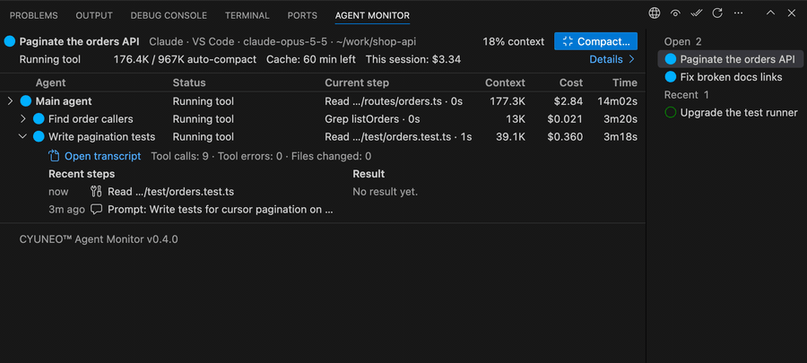

# CYUNEO Agent Monitor

[English](README.md) · **简体中文** · [繁體中文](README.zh-TW.md) · [한국어](README.ko.md) · [日本語](README.ja.md)

在一个地方看到你所有的 AI 编程聊天窗口，就在终端旁边：哪些智能体在运行，哪些需要你处理，每个上下文用了多少。支持 Claude Code、Codex 和 GitHub Copilot Chat，Gemini CLI 和 Qwen Code 目前是预览。

[**在 VS Code 中安装**](https://vscode.dev/redirect?url=vscode:extension/cyuneo.cyuneo-agent-monitor) · [在 VS Code 市场查看](https://marketplace.visualstudio.com/items?itemName=cyuneo.cyuneo-agent-monitor)

> **预览版（0.5.0）。** 发现任何不对劲的地方，欢迎到 [GitHub Issues](https://github.com/cyuneo/cyuneo-agent-monitor/issues) 反馈。

## 为什么做这个

Claude Code 和 Codex 现在会同时跑好几个智能体：子智能体、后台智能体、整条工作流。可在 VS Code 里，这些工作大多看不见：

- **看不到谁在做什么。** 智能体视图要点开才出现，一个在等你批准的智能体可能就这么干等着，没人发现。
- **上下文悄悄变满。** 往往是自动压缩在不合适的时候突然触发，或者长对话开始忘事，你才发觉。
- **离开一会儿，缓存就过期了。** 一小时后回来，下一条消息要按全价把整个上下文重新读一遍。
- **撞上额度，工作停在半路。** 智能体停了，你得自己发现、等额度重置、再手动让它们继续。

## 它能帮你做什么

- **一眼看全所有聊天。** 终端旁边的面板列出所有打开中和最近的聊天，每个都带状态灯。点一个，就能看到它里面的智能体、各自在哪一步、用了多少 token 和费用。
- **需要你的时候马上知道。** 等你批准或回答的聊天会亮品红色灯；完成和出错也各有颜色，状态栏上同样看得到。
- **不在电脑前也能收到提醒。** 聊天开始等你时，VS Code 或系统会通知你，愿意的话还能响一声；也可以把简短消息推送到手机或团队聊天（ntfy、Bark、Server酱、飞书、钉钉、企业微信、Telegram、Discord、Slack），出错和撞额度时也会推送。设好勿扰时段，夜里就不打扰你。
- **快到上限前先提醒你。** Codex 用量到 90% 时会提醒你；打开相应设置后，今天的估算费用超过你定的预算、某个聊天的上下文快到自动压缩点时，也会提醒你。
- **把上下文管起来。** 看到每个聊天用了多满；在面板里直接压缩（可以换便宜的模型，先看费用估算）；自己决定什么时候自动压缩；缓存快过期前提醒你。
- **撞额度后接着干。** 显示额度什么时候重置，并准备好继续用的提示词或命令，复制就能用。
- **看看这段时间用了多少。** 用量历史页面按天显示 Claude Code 和 Codex 最近 30 天的估算费用和 token，也能按模型拆开看。
- **知道聊天记录存在哪。** 看到 Claude Code 和 Codex 的聊天记录占了多少空间，并给出把它们搬到别的磁盘的参考命令。

它只读取所支持的工具本来就写在你电脑上的记录，不收集任何数据；除非你打开 **允许联网**（默认关闭），扩展本身不联网；目前只有推送通知会用到它。

## 支持的工具

- **Claude Code** 和 **Codex**：VS Code 扩展、命令行或桌面应用里的，包括它们的子智能体。
- **GitHub Copilot Chat**：VS Code 内置的聊天，包括智能体模式。
- **Gemini CLI** 和 **Qwen Code**，目前是**预览**。对它们的支持是按官方公开的记录格式做的，还没有拿真实会话验证过。发现不对劲的地方，欢迎到 [GitHub Issues](https://github.com/cyuneo/cyuneo-agent-monitor/issues) 反馈。

没安装的工具会直接跳过，每个工具也都能在设置里单独关闭。各工具能看到的内容不完全一样：比如 Copilot Chat 显示的是 Copilot credits，而不是美元费用；Gemini CLI 的状态是推测出来的。压缩、用量历史、今日总费用和存储页面只覆盖 Claude Code 和 Codex。详见完整使用指南里的[支持的工具](docs/GUIDE.zh-CN.md#支持的工具)。

## 开始使用

1. 点上面的 **在 VS Code 中安装**，或在扩展视图里搜索 **CYUNEO Agent Monitor**。
2. 打开底部面板里 Terminal 旁边的 **智能体监视器** 标签页。
3. 点列表里的一个聊天，就能看到它的智能体。

所有功能、命令和设置的详细说明，见 **[完整使用指南](docs/GUIDE.zh-CN.md)**。

## 系统要求

- VS Code 1.94 或更高版本。
- 在同一台电脑上使用至少一个支持的工具：Claude Code 或 Codex（VS Code 扩展、命令行或桌面应用）、VS Code 里的 GitHub Copilot Chat、Gemini CLI 或 Qwen Code。
- 要在后台压缩一个已关闭的聊天窗口，还需要 Claude Code 命令行。扩展会先在 PATH 里找 `claude`，再到已安装的 Claude Code 扩展里找。你也可以设置 `agentMonitor.claude.cliPath`。
- 自动化测试在 macOS、Windows 和 Linux 上运行（Node.js 22，Linux 上还有 Node.js 20）。在 VS Code 里的实际使用测试目前只在 macOS 上做过。

## 隐私

- 没有遥测；除非你打开 **允许联网**（默认关闭），扩展本身不联网，目前只有推送通知会用到它。你的对话只留在你自己的电脑上。
- 推送通知是可选的，默认关闭。开启后，只有一条简短消息会发到你设置的服务：项目文件夹名和状态（你允许的话再加上对话标题和子智能体名称）。其他任何内容都不会离开你的电脑。
- 用量历史在你的电脑上计算，提示音由你自己的系统播放，都不会发出任何数据。
- 只有在你确认之后，它才会修改文件或运行 Claude Code（见[免责声明](#免责声明)）。
- 详见指南里的[它读什么](docs/GUIDE.zh-CN.md#它读什么)和[隐私](docs/GUIDE.zh-CN.md#隐私)。

## 非官方声明

CYUNEO Agent Monitor 是一个独立的、非官方的项目，与 Anthropic、OpenAI、GitHub、Microsoft、Google 或 Alibaba 没有关联，未获其认可或赞助。产品名称归其各自所有者所有，这里使用它们仅为说明本扩展所对接的对象。

## 许可证

CYUNEO Agent Monitor 按 [PolyForm Noncommercial License 1.0.0](LICENSE) 授权，**个人和非商业用途免费**。本项目公开源代码，但不是开源软件。

- **无需申请即可使用：** 个人使用、学习、业余项目和研究，以及慈善机构、教育机构、公共研究机构、公共安全或卫生机构、环保组织和政府机构使用。出于这些目的，你也可以修改代码并分享，但要一并附上许可证和 `Required Notice` 那一行。
- **需要另行取得商业授权：** 其它用途都需要，例如在公司里用于工作、放进产品或服务、拿去销售。咨询商业授权，请在 [GitHub Issues](https://github.com/cyuneo/cyuneo-agent-monitor/issues) 新建一个标题为“Commercial license”的 issue。
- 以上只是方便阅读的摘要，具有约束力的只有[许可证原文](LICENSE)。

## 免责声明

- **不提供任何担保。** 本扩展按“原样”提供，不附带任何形式的担保。在法律允许的范围内，作者不对使用本扩展造成的任何损失或损害负责，包括数据丢失、工作成果丢失、额外费用或账号问题。
- **只在你确认后才动手。** 本扩展读取你电脑上的会话记录。只有在你确认之后，它才会修改文件或运行 Claude Code：修改自动压缩设置（只改一项，并留有备份）、在后台压缩、写交接笔记。
- **用量和费用由你承担。** 后台压缩和交接笔记运行的是你自己的 Claude Code，会计入你套餐的用量额度或 API 账单。显示的费用是按官方价目表估算的，不是账单。
- **迁移数据风险自负。** 存储页只给出参考命令，由你自己核对并决定是否运行。
- **遵守各服务的条款。** 你需要自行确保对你所监控的 AI 编程工具及其服务，以及你设置的推送服务的使用符合它们的条款。
- **不构成专业建议。** 上下文与压缩小贴士整理自公开资料，可能已经过时。

## 版权与商标

- © 2026 Chenyu Guo。许可证未明确授予的一切权利均予保留。
- 本项目由 Chenyu Guo 在 AI 辅助下开发（主要使用 Claude Code）。产品构想、需求和设计决定来自作者本人，结果也经过作者审阅。
- CYUNEO™ 名称和标志不在授权范围内。不得用于你自己的产品，也不得以任何方式暗示你的版本来自 CYUNEO 或得到 CYUNEO 认可。
- 未取得授权而商用、删除版权或许可声明、或者换个名字当作自己的作品重新发布，都侵犯作者的权利。作者可以要求 GitHub、Visual Studio Marketplace、Open VSX 等平台下架这类副本，并保留采取进一步法律行动的权利。
- 如果发现有人违反许可证使用或销售本项目，请在 [GitHub Issues](https://github.com/cyuneo/cyuneo-agent-monitor/issues) 告诉我们。

## 支持与安全

- 提问、报错和想法：[GitHub Issues](https://github.com/cyuneo/cyuneo-agent-monitor/issues)，详见 [SUPPORT.md](SUPPORT.md)。
- 安全问题：请按 [SECURITY.md](SECURITY.md) 中的说明私下反馈。
- 发布记录：[CHANGELOG.md](CHANGELOG.md)。第三方组件：[THIRD_PARTY_NOTICES.md](THIRD_PARTY_NOTICES.md)。

---

CYUNEO™ / Connect Intelligence. Create Your Universe.

© 2026 Chenyu Guo. Free for personal and noncommercial use under the [PolyForm Noncommercial License 1.0.0](LICENSE). The CYUNEO™ name and logo are not licensed.