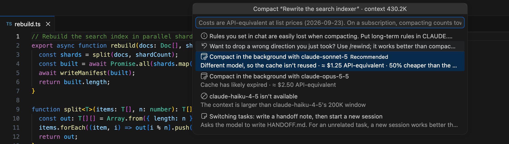
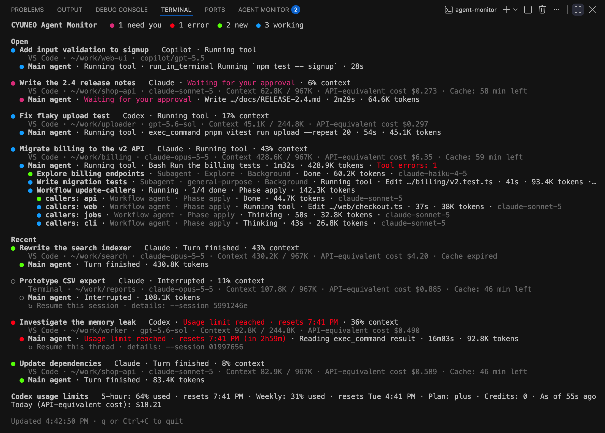

# CYUNEO Agent Monitor 完全ガイド

[English](GUIDE.md) · [简体中文](GUIDE.zh-CN.md) · [繁體中文](GUIDE.zh-TW.md) · [한국어](GUIDE.ko.md) · **日本語**

[← READMEに戻る](../README.ja.md)

## 機能

### ターミナルのように動くパネル

- **エージェントモニター**（英語UIではAgent Monitor）は、ターミナルの隣、下部パネルのタブとして開き、見た目もターミナルのようになります: 余分なビューヘッダーのない、ひとつのパネルです。選択したチャットのエージェントがパネルの大部分を占め、狭いチャット一覧がターミナルのタブ一覧のように片側に配置されます。
- **チャット一覧。** 開いているチャットと最近のチャットがすべて、それぞれステータスランプ付きで表示されます。**開いている**（Claude Codeがまだチャットを開いている、またはCodexがターンの途中）と**最近**にグループ分けされます。行の高さはターミナルのタブと同じで、選択したチャットはハイライトされます。タイトルが読めるよう、各行にはステータスランプとタイトルだけが表示されます。コンテキストが大きく対応する価値があるときは、タイトルの後ろに小さな印が付きます: **◔** 圧縮を検討、**◕** 早めに対応。行にカーソルを合わせると、ステータスやコンテキストなどの詳細がわかります。
- **一覧はターミナルのタブ一覧と同じ側に配置されます**（既定は右側で、`terminal.integrated.tabs.location`に従います）。`agentMonitor.sessionListPosition`を設定すれば、自分で左右どちらかに変更できます。区切り線をドラッグして幅を調整し、ダブルクリックで既定の200pxに戻し、ほぼ閉じるまでドラッグするとステータスランプだけが並ぶ細い帯に縮まります。パネルが500px未満のときは自動的にこの細い帯になります。幅は記憶されます。
- **チャットにカーソルを合わせる**と、**圧縮…**ボタン（コンテキストが20K以上のとき）と、右クリックメニューと同じ操作をまとめた**…**ボタンが表示されます。キーボードも使えます: 矢印キー、Home、Endで一覧内を移動し、EnterまたはSpaceで選択し、文字を入力すると先頭文字でチャットへジャンプし、Shift+F10で操作メニューを開きます。
- **エージェント。** チャットをクリックすると、その中で何が動いているかが見えます: 一番上にメイン会話、続いてサブエージェントとバックグラウンドエージェント、ワークフローエージェントはそのワークフローの下にまとめて表示されます。
- **チャットのヘッダーは2行だけ**なので、パネルが低くてもエージェントがすぐ見えます。1行目はタイトルで、**圧縮…** の横にコンテキストの使用率（「コンテキスト 41%」）が表示されます。2行目はステータス、自動圧縮ポイントに対するコンテキスト、ヒント、キャッシュの残り時間、このチャットの費用です。それ以外（コンテキストのバー、自動圧縮の設定、今日の合計、お知らせ、再開プロンプト、トランスクリプト行）は **詳細 ▸** の中にあります。使用量の上限、APIエラー、圧縮ループなど急ぎの問題があるときだけ、1行増えます。エージェント表の見出しはスクロールしても上に固定され、パネルの高さが400px未満のときは費用と時間の列が隠れます。
- Claude CodeまたはCodexのチャットタブに切り替えると、一覧でそのチャットが自動的に選択されます。これはタブを切り替えたときのみ発生し、更新時には発生しないため、選択状態が保たれます。
- サイドバーには**概要**ツリーもあり、ステータスバーには件数付きのステータスランプが、そして対応が必要なチャット数を示すバッジもあります。

### ステータスランプ

同じ6種類のランプが、セッション一覧、エージェント表、概要、ステータスバー、ターミナル版のどこでも共通して使われます。

| 色 | 意味 |
| --- | --- |
| マゼンタ | **対応が必要**: 承認、回答、またはダイアログへの対応待ち |
| 赤 | **エラー**: 使用上限またはAPIエラーで停止 |
| 青 | **実行中** |
| 明るい緑 | **完了（未確認）**: 完了していて、まだ確認していない |
| 暗い緑 | **完了**: 完了していて、すでに確認済み |
| グレー | **アイドル**: 中断された、停止した、または最近活動がない |

ランプは形も違うため（塗りつぶしか輪郭のみか）、色だけに頼りません。ライトテーマとハイコントラストテーマにはそれぞれ専用の色があり、`workbench.colorCustomizations`ですべての色を変更できます。

ライブ状態を報告するClaude Codeのバージョンでは（[読み取る内容](#読み取る内容)を参照）、「対応が必要」は正確です。それより古いバージョンとCodexでは、拡張機能は推測するしかありません。クイックツール（ファイルの読み書き・編集、検索、パッチ）が60秒間結果を返さないと、チャットに**承認待ちの可能性**が表示されます。シェルコマンドなどの長時間コマンドは推測しません。この推測は`agentMonitor.approvalGuess`で変更または無効化できます。

### 「対応が必要」の通知

- チャットやその中のエージェントがあなたを待ち始めたとき（承認、回答、ダイアログ、そして推測による**承認待ちの可能性**も含む）、エージェントモニターがお知らせします。フォーカスのあるVS Codeウィンドウでは**表示**ボタン付きのメッセージを表示し、ボタンを押すとパネルでそのチャットを選択します。現在の範囲で見えないチャットは、別のチャットを選択するか範囲を切り替えるまで、このウィンドウの一覧に追加されます。範囲の設定そのものは変わりません。いま見ているチャット（タブがアクティブ、またはパネルに表示中）についてはメッセージを表示しません。
- どのVS Codeウィンドウにもフォーカスがないときは、代わりにシステム通知を表示します（macOSとLinux）。Windowsとリモートウィンドウ（SSH、WSL、コンテナー）では、チャットがまだ待っていれば、次に切り替えたVS Codeウィンドウにメッセージを表示します。
- ウィンドウをいくつ開いていても、1回の待機につき通知は1回、1つのウィンドウからだけです。この拡張機能を入れた複数のエディター（VS Code、VS Code Insiders、Cursorなど）の間でも同じです。ウィンドウを開いた時点ですでに待っていたチャットや、設定を変えたことで表示されるようになったチャット（Codexをオンにした場合など）は通知しません。ウィンドウの範囲外のチャットも通知の対象です。
- 通知は`agentMonitor.notifyNeedsYou`でオフにできます。どのVS Codeウィンドウにもフォーカスがない間は記録を2秒ごとではなく5秒ごとに読み込みます（`agentMonitor.backgroundRefreshSeconds`）。システム通知を送る前に記録をもう一度読み込むので、すでに答えた確認は通知されません。そのため通知が数秒遅れることがあります。
- 対応できなかったときにスマートフォンにも知らせてほしい場合は、[スマートフォンやチームのチャットへのプッシュ](#スマートフォンやチームのチャットへのプッシュ)をご覧ください。

### スマートフォンやチームのチャットへのプッシュ

オプション機能で、**既定はオフ**です。オンにすると、次のようなときにエージェントモニターがスマートフォンやチームのチャットへ短いメッセージを送れます。

- **エージェントが対応を待っていて**、`agentMonitor.push.delaySeconds`（既定は30秒）たってもまだ待っているとき。先にデスクトップ通知が出て、その間に対応すればプッシュは送りません。待っている間にコンピューターがスリープした場合、復帰後にその待ちをプッシュすることはありません。
- **エージェントがAPIエラーで停止したとき**（すぐに送ります）。
- **Claude CodeまたはCodexの使用上限に達したとき**と、**上限がリセットされたとき**。

4つとも既定でオンです。設定メニューの**イベントを選ぶ…**、または`agentMonitor.push.events`で選べます。

**送る内容:** プロジェクトフォルダー名と状態です（例:「エージェントへの対応が必要です · my-app」）。使用上限については製品名とリセット時刻です。`agentMonitor.push.includeTitle`をオンにするとチャットのタイトル（とサブエージェント名）が加わりますが、送るのは本当のタイトル（自分で付けたもの、またはエージェントやアプリが付けたもの）だけです。最初のプロンプトから作ったタイトルは決して送りません。拡張機能がプロンプト、コード、ファイルパス、トークン数、コストを付け加えることはありませんが、タイトルとサブエージェント名は書かれたとおりに送るため、ファイル名が含まれることがあります。

**設定方法:** コマンドパレット、またはパネルのタイトルバーの**…**メニューから**エージェントモニター: プッシュ通知…**を実行し、**プッシュのチャネルを追加**を選びます。サービスを選び、プライバシーに関する説明（サービスごとに1回だけ表示）を読み、各項目を入力してからテストメッセージを送ります。トークン、キー、Webhook URLはVS Codeの安全なストレージに保管され、`settings.json`に書かれることはありません。チャネルを編集するときは、秘密情報の欄を空のままにすると保存済みの値を使い、任意の秘密情報（ntfyのアクセストークン、FeishuやDingTalkの署名シークレット）は`-`と入力すると削除できます。秘密情報はコンピューター間で同期されません。設定の同期を使っていると、別のコンピューターで追加したチャネルは、このコンピューターでも設定するまで**このコンピューターでは未設定**と表示されます。チャネルを削除すると、削除したコンピューターの秘密情報だけが消えます（ほかのコンピューターに残ったものが再び使われることはありません）。自前のntfyやBarkのサーバーに`http://`を使えるのは、localhostとプライベートネットワークのアドレスだけです。暗号化されず、別のネットワーク（カフェやホテル）では同じアドレスが他人の機器であることもあるので、自分で管理しているネットワークのサーバーでだけ使ってください。同じメニューで、プッシュがオンかどうかと使用中のチャネル数を確認でき、テストメッセージの送信、チャネルの編集・オフ・削除、プッシュのオン・オフ、イベントの選択ができます。

| サービス | 必要なもの |
| --- | --- |
| **ntfy** | ntfyアプリを入れ、設定時に提案されるトピックを購読します。ntfy.shではトピックを知っている人なら誰でも読めるため、トピックはランダムに作られます。自前のサーバーとアクセストークンも使えます。 |
| **Bark**（iPhone） | Barkアプリのデバイスキー: 例のURLでサーバーアドレスのすぐ後に続く部分です。 |
| **ServerChan**（WeChat） | sct.ftqq.comで取得したSendKey（`SCT…`、ServerChan³は`sctp…`）。無料プランは1日5件までなので、このチャネルの1日の上限は5から始まります。 |
| **Feishu / Lark** | グループにカスタムボットを追加し、Webhook URLをコピーします。署名検証をオンにしている場合はシークレットを、キーワードを使っている場合はそのうち1つを入力します。 |
| **DingTalk** | グループにカスタムロボットを追加し、Webhook URLをコピーします。セキュリティ設定が署名ならシークレット（`SEC`で始まる）を、カスタムキーワードならキーワードを1つ入力します。 |
| **WeCom** | グループロボットを追加し、Webhook URLをコピーします。 |
| **Telegram** | @BotFatherでボットを作り、そのトークンと自分のチャットIDを入力します。ボットからは会話を始められないので、先にボットへメッセージを送っておいてください。 |
| **Discord** | チャンネルの設定の「連携サービス > ウェブフック」でウェブフックを作り、URLをコピーします。 |
| **Slack** | チャンネル用のIncoming Webhookを作り、URLをコピーします。 |

**上限:** 数秒以内に続けて起きた更新は1つのメッセージにまとめて送ります。各チャネルへの送信は10秒に1件、1時間に20件までで、**1 日の上限**を設定していれば（0は無制限）それも守ります。1時間や1日の上限を超えたメッセージは後で送らずにスキップし、エージェントモニターの出力に記録します。上限はすべてのウィンドウを合わせて数え、1つのイベントを送るのは1つのウィンドウだけです。あるチャネルへの送信が3回続けて失敗すると、**プッシュの設定を開く**ボタン付きの警告を1回だけ表示し、そのチャネルへの送信がまた成功するまで繰り返しません。

**リモートウィンドウ:** プッシュは拡張機能が動いているマシンから送られます。リモートウィンドウ（SSH、WSL、コンテナー）ではリモートのマシンなので、そのマシンからサービスに接続できる必要があります。チャネルの秘密情報もそのマシンで使われる（VS Codeがそこの拡張機能に渡す）ため、プッシュがオンの間は信頼できるマシンでだけリモートウィンドウを開くか、先にプッシュをオフにしてください。

**プロキシ:** プッシュはVS Codeを通して送られるため、VS Codeがプロキシ設定を拡張機能に渡している場合（`http.fetchAdditionalSupport`、最近のバージョンでは既定でオン）は、VS Codeで設定したプロキシ（`http.proxy`）が使われます。プロキシ環境でプッシュが失敗する場合は、これらの設定を確認してください。

### 順序がぶれない

- チャットは開始時刻順（新しい順）に並びます。エージェントは開始時刻順（古い順）に並びます。
- 活動、ステータス、トークン数によって並び替えられることは一切ありません。エージェントが完了しても、その場所にとどまり、ランプの色だけが変わります。
- チャットは**開いている**と**最近**の間を移動するときだけ位置が変わります。エージェント表は行をその場で更新するので、スクロール位置と展開した行はそのまま保たれます。

### モデルを選べてコスト見積もり付きの圧縮ボタン



コンテキストが20Kトークン以上ある各チャットには、**圧縮…**ボタンが付きます。チャット一覧でカーソルを合わせたときのその行にも、エージェントの上にあるチャットヘッダーにもあります。選ぶまでは何も実行されません。

- **Claude Codeのチャットが開いている場合:** 拡張機能がそのチャットに切り替え、入力欄に`/compact`を入力し、続けて要約に必ず残すべき内容（目標、決定事項、未解決の問題、ファイルパス、あなたが述べた制約）を記したテンプレートを追加します。このテキストはクリップボードにもコピーされます。好みで編集してから、自分でEnterを押してください。
- **Claude Codeのチャットが閉じている場合:** 拡張機能はローカルのClaude Codeを使ってバックグラウンドで圧縮でき、モデルを選べます:
  - そのチャットが元々使っていたモデル
  - Claude Sonnet 5
  - Claude Haiku 4.5（コンテキストが200Kウィンドウに収まる場合のみ選択可能）

  各選択肢には推定コストが表示され、最も安いものに**おすすめ**マークが付きます。実行前に確認ダイアログが表示されます（オフにできます）。実際に実行する直前に拡張機能がもう一度確認し、チャットが再度開かれていたら停止します。
- **見積もりはプロンプトキャッシュの状態を反映します。**
  - キャッシュがまだ有効な間は、同じモデルで圧縮するのが圧倒的に安いです。
  - 期限切れ後は、より安いモデルに切り替えるとおよそ半額になります。
  - 例えば、Claude Opus 5.5のセッションでコンテキストが400Kトークンの場合: キャッシュが有効なら約$0.40、1時間キャッシュが切れた後は同じモデルで約$3.52、Sonnet 5なら約$1.76。
- **メニューにはこんな項目もあります:** **引き継ぎメモを書く**。新しいタスクに切り替えるときに便利です。その場合は圧縮より新しいセッションの方が向いています。
- **通知**（それぞれオフにできます）:
  - 大きなアイドル状態のチャットのプロンプトキャッシュが期限切れになる少し前、または大きなチャットを閉じるとき、圧縮がまだ安いうちに通知します
  - 圧縮後、重要なルールがまだ守られているか確認するよう通知します
- **Codexのチャット:** 拡張機能がCodexで会話を開き、`/compact`をコピーして貼り付けられるようにします。
- **圧縮回数:** **詳細**に**N回圧縮済み**（自動+手動）が表示されます。2回以上圧縮した後、コンテキストが再び大きくなっている場合は、引き継ぎメモを書いて新しく始めることを提案します。チャットが10分以内に2回圧縮された場合、または圧縮直後にすぐ「早めに対応」の範囲に戻った場合は、エラーの色で**圧縮ループに陥っている可能性**が表示されます。「2回」は経験則であり、厳密な上限ではありません。

### 自動圧縮容量を自分で設定する

Claude Codeはコンテキストが一定の容量に達すると自動的に圧縮します。これは作業中に起こるため、キャッシュが有効で圧縮自体も安く済みます。選べるのは*容量をいくつに設定するか*です。チャットの**詳細**にある**自動圧縮: … ▾**をクリックするか、チャットを右クリックして**自動圧縮のしきい値を設定…**を選んでください。

- 一覧には、各プリセットをそのチャットのモデルに合わせた容量（パーセンテージとトークン数）に換算した値、実際に大体どこで圧縮されるか、根拠の強さ、そして「呼び出しごとに約$0.069、デフォルトより45%安い」といった見積もりが表示されます。**カスタム…**は100Kから1Mまでの任意の値を受け付け、**参考ガイドを見る**はこれらの数値の根拠となる資料を開きます。
- **すべてのプロジェクト:** チャットが開いている場合、拡張機能がそのチャットに`/autocompact <値>`を入力しておきます。Enterを押すとClaude Codeがすぐに適用し、ユーザー設定に保存します。チャットが閉じている場合、拡張機能は`~/.claude/settings.json`に`autoCompactWindow`を書き込みます。
- **このプロジェクトのみ:** 拡張機能は`<プロジェクト>/.claude/settings.local.json`に`autoCompactWindow`を書き込み、これはユーザー設定より優先されます。新しいセッションには適用され、開いているセッションは開き直す必要がある場合があります。
- 拡張機能が設定ファイルに書き込むときは、そのキー1つだけを変更し、既存の書式を保ち、書き込み前にバックアップを取り、ファイルを解析できない場合はまったく書き込みません。**デフォルトのまま**を選ぶとそのキーが削除されます。
- **Codex:** 拡張機能は`config.toml`を編集しません。`model_auto_compact_token_limit = 217600`のような行をコピーして`~/.codex/config.toml`を開き、ファイルの先頭、どの`[テーブル]`よりも前に貼り付けるよう案内します。

「リサーチにはX%、コーディングにはY%」といった標準的な答えを示したベンダーや論文はありません。以下のプリセットは、ベンダーのデフォルト値、ベンダーのベンチマーク設定、実務者のデータ、コストモデルの間の妥協案であり、根拠の列にそれぞれどれくらい確かなものかを示しています。

| プリセット | 1Mウィンドウモデル: 設定値 → 大体ここで圧縮 | 200Kウィンドウモデル | Codex | 呼び出しごと（Opus 5.5、1M）/ デフォルト比 | 根拠 |
| --- | --- | --- | --- | --- | --- |
| **デフォルトのまま**（気にしたくない人向け） | 未設定 → 約967K | 未設定 → 約167K | 90%（約245K） | $0.126 / 100% | 強い: ベンダーのデフォルト値、公式に強く推奨されている |
| **コーディング（バランス型）** | 400K（40%）→ 約367K | 未設定 | 90% | $0.069 / 約55% | 中程度: ある実務者が観察した873件の圧縮データ（コードの構築・理解では約300〜450K）と実務経験。対照実験はなし |
| **リサーチ / 検索** | 250K（25%）→ 約217K | 160K（80%）→ 約127K | 80% | $0.056 / 約44% | 中程度: Anthropic自身の検索ベンチマーク設定は200Kでトリガーされる。DeepSeek-V3.2とKimi K2.5はウィンドウの80%でトリガーされる。リスク: 最初の質問を見失いやすいのでファイルに書いておくこと |
| **長時間の自律実行** | 600K（60%）→ 約567K | 未設定 | 90% | $0.088 / 約70% | 弱い: 直接的な根拠のない妥協案。最も重要なのは目標と制約をファイルに書いておくこと |
| **コスト優先** | 200K（20%）→ 約167K | 未設定（下げても節約にならない） | 80% | $0.052 / 約41% | 中程度: コストモデルと同じ実務者のコスト最適点（約220K）。代償: 圧縮回数がデフォルトの約7倍、情報損失が最も大きい |

- **設定した値がそのまま圧縮ポイントになるわけではありません。** 実際には約33K早く圧縮されます（公式の「1Mで約967Kで圧縮」から推定）。つまり「400K」は実際には約367Kで圧縮されるという意味です。
- **200Kウィンドウのモデルでは、しきい値を下げても節約はほとんどありません**（呼び出しごとに約3%）。そのため品質のためだけに行ってください。設定値は100Kより下げられないため、これらのモデルは50%〜100%しか使えません。
- **すべてのモデルに1つの値が適用されます。** 同じ範囲内で1Mモデルと200Kモデルを切り替える場合、より小さいウィンドウが上限になります。
- **圧縮のたびに細部が失われます。** 長期的なルールは`CLAUDE.md`に書いておき、別のタスクなら圧縮の代わりに新しいセッションを始めてください。
- **コストモデル:** キャッシュは常に有効、呼び出しごとに約3Kトークンが追加され、圧縮後は約30K残り、要約は圧縮ポイントの約4%（2K〜20K）です。価格はそのチャットのモデルを基準にします。
- **Claude Code自身のアドバイス:** 「The auto setting picks a window tuned for your model and is strongly recommended for the best cost and performance. Overriding auto may result in high token usage, especially when resuming long sessions.」（auto設定はモデルに合わせて調整されたウィンドウを選び、コストとパフォーマンスの両面で強く推奨されています。autoを上書きすると、特に長いセッションを再開する際にトークン使用量が多くなることがあります。）理由は説明されていません。考えられる原因: 新しいしきい値よりすでに大きい古いチャットを再開すると、キャッシュが冷えた状態ですぐに圧縮される。しきい値がチャット開始時のサイズに近すぎると、何度も繰り返し圧縮される。要約で失われた詳細のせいで、ファイルを読み直す追加の呼び出しが必要になることがある。
- Claude Codeに`CLAUDE_CODE_AUTO_COMPACT_WINDOW`が設定されている場合、これらの設定すべてより優先されます。

出典を含む完全な参考資料（他のツールのデフォルト値、ベンダーのベンチマーク、ブログのアドバイス、コストモデル）は[docs/compaction-threshold-guide.md](compaction-threshold-guide.md)（英語）にあります。

### 詳細

エージェントをクリックすると、最近のステップ、最終結果（コピーボタン付き）、変更したファイル（クリックで開く）、ツールエラーが見られます。**トランスクリプトを開く**は元のセッション記録を開きます。

**詳細**には**トランスクリプト**行もあります: チャットがどこに保存されているか（ホームフォルダーは`~`に短縮表示）、トランスクリプト、そのサブエージェント、ファイルバックアップのサイズ、そして**Finderで表示**（Windowsではエクスプローラー）と**パスをコピー**ボタン。

### 使用量とコスト

- **コンテキスト:** 自動圧縮ポイントに対してどれだけ使っているか（例:「412K / 967K 自動圧縮」）、モデルのウィンドウに対する割合（「1Mウィンドウの41%」）、そして自動圧縮まであとどれくらいか。チャットが自動圧縮に近づくにつれてバーが埋まっていきます。
- **パーセンテージとウィンドウはClaude CodeとCodex自身の数値をそのまま使います。** パーセンテージはClaude Code自体の計算式を使います: コンテキストトークン数（最新の呼び出しの入力+キャッシュ書き込み+キャッシュ読み取り）÷ コンテキストウィンドウ、四捨五入。ウィンドウはそのセッションのClaude Codeのコスト記録（モデルが1Mウィンドウで実行されているかがわかる）から取得し、それがなければモデルの標準ウィンドウを使います。Codexの場合はCodexのログから取得します。
- **自動圧縮がどこで、なぜ起こるか:** 設定（このプロジェクトのローカル設定、このプロジェクトの設定、またはユーザー設定）から順に取得し、なければ**実測値**（そのモデルが最後に自動圧縮した地点、拡張機能が記憶）、それもなければ公式のデフォルト値を使います。ツールチップにどれが適用されているか書かれています。Claude Codeに`CLAUDE_AUTOCOMPACT_PCT_OVERRIDE`が設定されていると、表示より早く圧縮されます。拡張機能はClaude Codeの環境変数を見ることができません。
- **コンテキストヒント:** コンテキストが大きく、次の良い区切りで対応する価値があるときに、控えめなラベル（「圧縮を検討」「早めに対応」）が表示されます。ランプの色は変わりません。
- **プロンプトキャッシュ:** 各Claude Codeチャットのキャッシュカウントダウン（「キャッシュ: あと38分」）。
- **API換算コスト:** 各エージェント、各チャット、そして今日の合計。Claude Codeのチャットの場合、ヘッダーにはClaude Code自身の累計コスト（「Claude Codeの集計」）が表示されます。それ以外はすべてトークン数と公開APIの価格表から推定した値です。サブスクリプションはこの方式で課金されないため、比較用として扱ってください。

### 使用上限と再開

- Claude Codeのチャットがセッション、週間、モデルの上限に達したタイミングと、上限がいつリセットされるかを表示します。
- Codexの5時間・週間の使用率を表示します。
- チャットやエージェントが使用上限、APIエラー、または中断によって停止したとき、**再開プロンプトをコピー…**がすぐ使えるプロンプトやターミナルコマンド（`claude --resume …`、`codex resume …`）をコピーします。コンテキストを読み直すのにかかるコストも見積もります。

### チャットの保存場所と移動方法

プロンプトキャッシュはAnthropicとOpenAIのサーバーにあり、あなたのコンピューターの容量は使いません。実際に容量を使い、繰り返し書き込まれるのはチャットのトランスクリプト、ファイルバックアップ、プラグイン、ログです。あるテストマシンでは、Claude Codeのセッションプロセス1つが1時間あたり23〜78 MBを書き込み、14〜36 MBを読み取り、300〜400 MBのメモリを使用しました。`~/.claude/projects`は932 MBで、`~/.codex`にはプラグイン298 MBとセッション52 MBがありました。

これだけの書き込み量はSSDの寿命にとって問題になりません。本当の問題はシステムディスクの空き容量です。ファイルを移動すると容量は空きますが、メモリ使用量は減りません。

**エージェントモニター: 保存場所と使用量**（エージェントモニターパネルのタイトルバーにある**…**メニュー、またはコマンドパレットから）は次を表示します:

- Claude Codeのデータフォルダー（`CLAUDE_CONFIG_DIR`または`~/.claude`）と、`projects`、`file-history`、`plugins`、`skills`、`cache`、`backups`、`shell-snapshots`、`~/.claude.json`のサイズ
- Codexのフォルダー（`CODEX_HOME`または`~/.codex`）、そのサブフォルダーとデータベースファイル
- どの項目がすでにシンボリックリンクになっているか、どこを指しているか
- 各ディスクの空き容量
- Claude Codeがトランスクリプトをどれくらい保持するか（`cleanupPeriodDays`、変更しなければ30日）

サイズはバックグラウンドで、ページが開いている間だけ、最大10分に1回測定されます。

> **移動方法は参考用です。** これらはこのコンピューター上のパスをもとに自動生成したもので、検証済みの手順ではありません。すべてのパスとコマンドをご自身で1つずつ確認し、大切なデータを先にバックアップしたうえで、実行するかどうかをご自身で判断してください。データの損失を含む結果はご自身の責任となります。この拡張機能は「現状のまま」提供され、いかなる保証もありません。ページでは、先に確認のチェックを入れないと、コマンドのコピーやターミナルへの入力はできません。

データを別のフォルダーに移動するコマンドも用意します。デフォルトの提案は空き容量が最も多い非システムディスクで、任意のフォルダーを自分で選ぶこともできます。

- **方法A（推奨）: 最大のフォルダーだけを移動し、シンボリックリンクを残す。** Claude Codeでは`projects`、Codexでは`sessions`です。macOSとLinuxでは、コマンドはおおよそ次のようになります（実際に生成されるコマンドは、まず邪魔なものがないか確認します）:

  ```sh
  mkdir -p '/Volumes/External/AI-Data/claude/projects' \
    && rsync -a ~/.claude/projects/ '/Volumes/External/AI-Data/claude/projects/' \
    && mv ~/.claude/projects ~/.claude/projects.bak \
    && ln -s '/Volumes/External/AI-Data/claude/projects' ~/.claude/projects
  # すべて問題なければバックアップを削除してください: rm -rf ~/.claude/projects.bak
  ```

  Windowsでは`robocopy`とディレクトリジャンクション（`mklink /J`）を使います。これらのWindows用コマンドは、まだWindowsで実際に試していません。
- **方法B（公式）: `CLAUDE_CONFIG_DIR`または`CODEX_HOME`でフォルダー全体を移動する。** VS Codeでは、Claude Code拡張機能の`claudeCode.environmentVariables`設定で設定し、ターミナルではシェルのプロファイルに追加してください。切り替え後、再度サインインが必要になる場合があります（未確認）。

何かを移動する前に:

- ページにはまだ開いているチャットが一覧表示されます。先に閉じて、移動中は新しく開かないでください。
- 外付けドライブはClaude CodeやCodexを起動する前に接続しておく必要があります。そうしないとリンクが存在しない場所を指し、セッションの保存が失敗したり空のフォルダーで開始したりします。
- iCloud DriveやDropboxのような同期フォルダーは使わないでください。継続的な書き込みは同期と競合します。
- すべて問題ないと確認できるまで`.bak`のコピーを残しておいてください。

**拡張機能はこれらのコマンドを絶対に自分で実行しません。** **コマンドをコピー**はコピーするだけで、**ターミナルで開く**はEnterを押さずに新しいターミナルに入力するだけなので、自分で確認してから実行できます。拡張機能はデータがどこへ行っても追従します: シンボリックリンクは透過的に扱われ、`CLAUDE_CONFIG_DIR`と`CODEX_HOME`も尊重されます。チャットをまったく保存したくない場合は、Claude Codeの`--no-session-persistence`フラグでトランスクリプトの記録をオフにできます（その場合エージェントモニターはそのチャットを見ることができません）。

### Claude CodeとCodex

- **Claude Code**: VS Code拡張機能、ターミナル、デスクトップアプリで、サブエージェント、バックグラウンドエージェント、ワークフローを含みます。
- **Codex**: VS Code拡張機能、CLI、デスクトップアプリで、サブエージェントとレビュースレッドを含みます。
- どちらも設定で個別にオフにできます。

### ターミナル版



同じ監視ロジックはターミナルでも動きます。ソースリポジトリには含まれていますが拡張機能パッケージには含まれておらず、Node.js 18以降が必要です（Node.js 24でテスト済み）:

```sh
git clone https://github.com/cyuneo/cyuneo-agent-monitor.git
cd cyuneo-agent-monitor
node bin/agent-monitor.js --watch          # その場で更新し続ける; qまたはCtrl+Cで終了
node bin/agent-monitor.js --session 1a2b   # チャットを1件詳しく表示: ステップ、結果、ファイル、エラー、再開
node bin/agent-monitor.js --json           # データをJSONとして出力
```

他のオプションには`--provider claude|codex`、`--window <minutes>`、`--here`（現在のフォルダーのチャットのみ）、`--today`、`--lang en|zh-cn|zh-tw|ko|ja`、`--no-color`があります。完全な一覧は`--help`で確認してください。

## インストール

- **ワンクリック:** [VS Codeにインストール](https://vscode.dev/redirect?url=vscode:extension/cyuneo.cyuneo-agent-monitor)をクリックすると、VS Codeでこの拡張機能のページが開きます。**インストール**をクリックしてください。
- **拡張機能ビューから:** **CYUNEO Agent Monitor**を検索して**インストール**をクリックします。[Visual Studio Marketplace](https://marketplace.visualstudio.com/items?itemName=cyuneo.cyuneo-agent-monitor)で公開しています。
- **コマンドラインから:**

  ```sh
  code --install-extension cyuneo.cyuneo-agent-monitor
  ```

インストール後、下部パネルの**エージェントモニター**タブを開くか、コマンドパレットから**エージェントモニター: エージェントモニターを表示**（英語UIでは**Agent Monitor: Show Agent Monitor**）を実行してください。

## 読み取る内容

すべて読み取り専用で、ユーザー自身が始める例外が1つだけあります: 自動圧縮のしきい値を設定すると、拡張機能がClaude Codeの設定ファイルに`autoCompactWindow`キーを書き込むことがあります（[自動圧縮容量を自分で設定する](#自動圧縮容量を自分で設定する)を参照）。閉じたチャットをバックグラウンドで圧縮するとき、そのチャット記録に要約を追加するのはClaude Code自身です。

| ファイル | 用途 |
| --- | --- |
| `~/.claude/projects/<project>/<session>.jsonl` | Claude Codeのチャット（メイン会話） |
| `~/.claude/projects/<project>/<session>/subagents/…` | サブエージェント、バックグラウンドエージェント、ワークフローエージェント |
| `~/.claude/projects/<project>/<session>/workflows/…` | ワークフロー名、状態、結果 |
| `~/.claude/sessions/*.json` | Claude Code自身が管理する実行中セッションの一覧: どのチャットが開いているか、それぞれが処理中か承認・回答・ダイアログを待っているか。`.json`ファイルのみを読み取り、隣にある`.key`ファイルとソケットは決して開きません。 |
| `~/.claude/settings.json`、`<project>/.claude/settings.json`、`<project>/.claude/settings.local.json` | 自動圧縮の設定（`autoCompactWindow`、`autoCompactEnabled`）と`cleanupPeriodDays` |
| `~/.claude/file-history/<session>`と`~/.claude`、`~/.codex`配下のその他のフォルダー | サイズのみ読み取ります（トランスクリプト行と保存ページ用）。ファイルの内容は開きません。 |
| `~/.codex/sessions/**/rollout-*.jsonl` | Codexのスレッド（サブエージェント・レビュースレッド、使用上限を含む） |
| `~/.codex/session_index.jsonl` | Codexのスレッドタイトル |
| `~/.codex/models_cache.json`、`~/.codex/config.toml` | Codexのコンテキストウィンドウと自動圧縮の上限 |

`CLAUDE_CONFIG_DIR`と`CODEX_HOME`は尊重されます。`agentMonitor.claude.projectsDir`と`agentMonitor.codex.home`で別の場所を指定することもできます。

拡張機能はVS Code自身のストレージにごく小さな情報だけを保存します: どのチャットをすでに確認したか、どの通知をオフにしたか、各モデルが実測で自動圧縮された地点、そして変更した設定ファイルのバックアップ。クリップボードへの書き込みは、コピーや圧縮関連の操作をクリックしたときだけ行われます。

`agentMonitor.shareScanAcrossWindows`がオンの間（既定）は、ウィンドウが1つだけでも、拡張機能のグローバルストレージにあるフォルダー（`shared-scan`）をウィンドウ間で共有します。そこにはどのウィンドウが記録を読み込むかが書かれ、そのウィンドウはほかのウィンドウのために最新の結果を`shared-scan/snapshot.json`に保存します: チャットのタイトル、プロジェクトフォルダー、ステップ、コスト。このファイルは結果が変わるたびに上書きされ、そのウィンドウが正常に閉じると削除されます。通知については、すべてのエディターを通じて1つのウィンドウだけが表示するように、待機ごとの小さな目印（ハッシュのみで、チャットの内容は含みません）をシステムの一時ディレクトリにある非公開フォルダーに置きます。目印は1日後に削除されます。プッシュをオンにすると、各チャネルの送信時刻（メッセージの内容は含みません）も同じフォルダー（`push-sent.json`）に記録し、上限がすべてのウィンドウで共通に効くようにします。

## プライバシー

- **プッシュをオンにするか自分でテストメッセージを送らない限り、拡張機能はネットワークリクエストを行いません。** テレメトリも、分析も、リモートコンテンツもありません。
- **プッシュ通知はオプションで、既定はオフです。** オンにすると、設定したサービスに短いメッセージだけを送ります。内容はプロジェクトフォルダー名と状態で、許可した場合はチャットのタイトルとサブエージェント名も加わります。それ以外がコンピューターの外に出ることはありません。ほかのWebリクエストと同じく、サービス側にはそのメッセージとIPアドレスが見えます。トークンとWebhook URLはVS Codeの安全なストレージに保管され、表示や記録されるエラーではすべて伏せられます。
- **閉じたチャットのバックグラウンド圧縮はClaude Codeを通して行われ**、それもユーザーが確認した後だけです。このとき拡張機能はローカルのClaude Codeを実行します（`claude -p --resume <session> --model <model> --output-format json "/compact …"`）。Claude Codeは自分で使うときと同じようにAnthropicに接続し、使用量はプランまたはAPIの請求に反映されます。
- **開いているチャットを圧縮する場合、または自動圧縮のしきい値を設定する場合は、入力欄にテキストを入れるだけです**（`/compact …`または`/autocompact …`）。Enterを押すまで何も送信されません。（チャットが閉じている場合や、このプロジェクトだけに適用する場合は、しきい値は設定ファイルに書き込まれます。[読み取る内容](#読み取る内容)を参照。）
- **データの移動はあなた次第です。** 保存ページはコマンドを生成するだけで、拡張機能が自分で実行することは決してなく、**ターミナルで開く**もEnterを押しません。
- **参考ガイドのリンク**は、クリックしたときだけブラウザでGitHubのページを開きます。
- **デスクトップ通知はこのコンピューター内で表示されるだけです。** VS Code、またはシステム標準の通知コマンド（macOSでは`osascript`、Linuxでは`notify-send`）で表示され、チャットのタイトルとプロジェクトフォルダー名が含まれます。ネットワークには何も送信しません。
- **あなたの会話はローカルにとどまります。** チャットのタイトル、ステップ、結果はあなた自身のVS Code内でのみ表示されます（通知はあなたのコンピューターの通知領域に表示されます）。
- **これらの数値はあなたのためのものであり、モデルのためのものではありません。** コンテキストサイズ、キャッシュのカウントダウン、コストがモデルに渡されることは決してありません。

## コマンド

すべてのコマンドはコマンドパレットの**エージェントモニター**カテゴリにあります。特定のチャットに作用するコマンドはその行から実行できます。コマンドパレットから実行すると、どのチャットか尋ねられます（選択中のチャットが一番上に表示されます）。

| コマンド | 場所 | 動作 |
| --- | --- | --- |
| **エージェントモニターを表示** | ステータスバーランプ、コマンドパレット | エージェントモニターパネルを開く |
| **サイドバーに概要を表示** | コマンドパレット | サイドバーで概要ツリーを開く |
| **更新** | パネルのタイトルバー、概要のタイトルバー | 今すぐ記録を再読み込み |
| **設定を開く** | パネルのタイトルバーの**…**メニュー、概要のタイトルバー | エージェントモニターの設定を開く |
| **すべてのセッションを表示** / **このワークスペースのセッションのみ表示** | パネルのタイトルバー、概要のタイトルバー、コマンドパレット | 範囲を切り替え |
| **確認済みにする** / **すべて確認済みにする** | チャットの右クリックまたは**…** / パネルのタイトルバー | 「完了（未確認）」を「完了」にする |
| **完了したエージェントを非表示** / **完了したエージェントを表示** | パネルのタイトルバー、概要のタイトルバー | 完了したエージェントを非表示または表示 |
| **トランスクリプトを開く** | チャットとエージェントの右クリック | 元の記録を開く |
| **トランスクリプトファイルを表示** | チャットの右クリックまたは**…**、チャットの詳細のトランスクリプト行 | Finderまたはエクスプローラーでトランスクリプトを表示 |
| **トランスクリプトのパスをコピー** | チャットの右クリックまたは**…**、チャットの詳細のトランスクリプト行 | トランスクリプトの完全なパスをコピー |
| **再開プロンプトをコピー…** | チャットの右クリックまたは**…**（再開する内容があるとき） | 再開プロンプトまたはターミナルコマンドをコピー |
| **圧縮…** | チャット行、右クリックまたは**…**（コンテキスト20K以上）、チャットヘッダー、コマンドパレット | チャットを圧縮する。[圧縮ボタン](#モデルを選べてコスト見積もり付きの圧縮ボタン)を参照 |
| **引き継ぎメモを書いて新しく始める…** | チャットの右クリック、圧縮メニュー、コマンドパレット | モデルに`HANDOFF.md`を書かせ、`/clear`と続きの手順を案内 |
| **自動圧縮のしきい値を設定…** | チャットの詳細の「自動圧縮」、チャットの右クリックまたは**…**、コマンドパレット | [自動圧縮容量を自分で設定する](#自動圧縮容量を自分で設定する)を参照 |
| **保存場所と使用量** | パネルのタイトルバーの**…**メニュー、コマンドパレット | [チャットの保存場所](#チャットの保存場所と移動方法)を参照 |
| **プッシュ通知…** | パネルのタイトルバーの**…**メニュー、コマンドパレット | [スマートフォンやチームのチャットへのプッシュ](#スマートフォンやチームのチャットへのプッシュ)を参照 |

## 設定

| 設定 | 既定値 | 説明 |
| --- | --- | --- |
| `agentMonitor.scope` | `all` | セッション一覧、概要、ステータスバー、バッジに含めるチャットの範囲: `all`、またはこの`workspace`のみ |
| `agentMonitor.followActiveChat` | `true` | Claude CodeまたはCodexのチャットタブに切り替えたとき、該当チャットを選択する |
| `agentMonitor.hideCompleted` | `false` | 完了したサブエージェント、ワークフローエージェント、完了したワークフローを非表示にする（メインエージェントは常に表示） |
| `agentMonitor.showStatusBar` | `true` | ステータスバーに全体のステータスランプを表示する |
| `agentMonitor.statusBarBackground` | `true` | 対応が必要なときは警告背景、失敗したときはエラー背景にする |
| `agentMonitor.showCost` | `true` | API換算コストを表示する |
| `agentMonitor.sessionListPosition` | `auto` | チャット一覧をパネルのどちら側に表示するか: `auto`（ターミナルのタブ一覧と同じ側）、`left`、`right` |
| `agentMonitor.notifyNeedsYou` | `true` | チャットがあなたを待ち始めたら通知する: フォーカスのあるウィンドウにはメッセージ、どのVS Codeウィンドウにもフォーカスがないときはシステム通知（macOSとLinux。それ以外では次に切り替えたウィンドウにメッセージ） |
| `agentMonitor.refreshSeconds` | `2` | セッション記録を再読み込みする頻度 |
| `agentMonitor.activeWindowMinutes` | `30` | この分数以内にアクティブだったチャットを表示する（開いているチャットと選択中のチャットは常に表示） |
| `agentMonitor.staleMinutes` | `5` | 新しい記録がこの分数ない場合、エージェントを活動なしとする |
| `agentMonitor.approvalGuess` | `fastTools` | チャットが実際の状態を報告できないとき、「承認待ちの可能性」をどう推測するか: `fastTools`、`allTools`、または`off` |
| `agentMonitor.approvalGuessSeconds` | `60` | クイックツールが結果なしで何秒経過したら推測を適用するか |
| `agentMonitor.backgroundRefreshSeconds` | `5` | どのVS Codeウィンドウにもフォーカスがない間は、代わりにこの秒数ごとに記録を読み込む（2〜60、`refreshSeconds`より速くはならない） |
| `agentMonitor.shareScanAcrossWindows` | `true` | 複数のVS Codeウィンドウで記録の読み込みを共有する（1つのウィンドウが読み込み、ほかはその結果を表示） |
| `agentMonitor.claude.enabled` | `true` | Claude Codeの記録を読み込む |
| `agentMonitor.claude.projectsDir` | `""` | Claude Codeの記録フォルダー（空欄なら`$CLAUDE_CONFIG_DIR/projects`または`~/.claude/projects`） |
| `agentMonitor.claude.cliPath` | `""` | Claude Codeのコマンドライン。バックグラウンド圧縮にのみ使用（空欄ならPATH上の`claude`、次にClaude Code拡張機能内を探す） |
| `agentMonitor.codex.enabled` | `true` | Codexの記録を読み込む |
| `agentMonitor.codex.home` | `""` | Codexのフォルダー（空欄なら`$CODEX_HOME`または`~/.codex`） |
| `agentMonitor.compactConfirm` | `true` | 閉じたチャットをバックグラウンドで圧縮する前に確認する |
| `agentMonitor.compactTemplate` | `""` | `/compact`の後に何を残すか記すテキスト（空欄なら表示言語に応じた組み込みテンプレートを使用） |
| `agentMonitor.contextHintStart` | `200000` | ウィンドウが500Kトークン以上のモデルの場合: このトークン数を超えたら次の良い区切りでの圧縮を提案 |
| `agentMonitor.contextHintAct` | `500000` | ウィンドウが500Kトークン以上のモデルの場合: このトークン数を超えたら自動圧縮が発動する前に対処することを推奨 |
| `agentMonitor.cacheReminder` | `true` | 大きなアイドル状態のチャットの1時間プロンプトキャッシュが期限切れになる少し前に通知 |
| `agentMonitor.cacheReminderMinutes` | `8` | 期限切れの何分前に通知するか |
| `agentMonitor.cacheReminderMinContext` | `150000` | このトークン数以上のチャットのみ通知 |
| `agentMonitor.cacheReminderShortTtl` | `false` | 5分キャッシュを使うチャットについても通知する |
| `agentMonitor.closeReminder` | `true` | キャッシュがまだ有効な大きなチャットを閉じたとき、圧縮するか引き継ぎメモを書くことを提案 |
| `agentMonitor.postCompactHint` | `true` | チャットが圧縮された後、重要なルールがまだ残っているか確認するよう通知 |
| `agentMonitor.push.enabled` | `false` | スマートフォンやチームのチャットへのプッシュ。[スマートフォンやチームのチャットへのプッシュ](#スマートフォンやチームのチャットへのプッシュ)を参照 |
| `agentMonitor.push.events` | すべてオン | プッシュするイベント: `needsYou`、`error`、`limitHit`、`limitReset` |
| `agentMonitor.push.delaySeconds` | `30` | チャットが何秒待ち続けたらプッシュするか（0–600） |
| `agentMonitor.push.includeTitle` | `false` | チャットのタイトルとサブエージェント名も送る（プロンプトから作ったタイトルは除く） |
| `agentMonitor.push.channels` | `[]` | 秘密情報を除いたプッシュのチャネル一覧。**プッシュ通知…**で変更 |
| `agentMonitor.onlyWorkspace` | `false` | 非推奨: `agentMonitor.scope`に置き換えられ、自動的に移行される |

プッシュの設定はユーザー設定からのみ読み込むため、ワークスペースの設定でプッシュをオンにしたり送信先を変えたりすることはできません。

## コンテキストと圧縮のヒント

これらのヒントは、公開されている研究と公式ドキュメントを調査した結果に基づいています。出典を含む完全なノートは[docs/research-context-compaction.md](research-context-compaction.md)（英語）にあります。自動圧縮のしきい値の選び方については、[docs/compaction-threshold-guide.md](compaction-threshold-guide.md)（英語）と[自動圧縮容量を自分で設定する](#自動圧縮容量を自分で設定する)を参照してください。

1. **念のためだけに圧縮しない。** タスクが順調に進んでいて、1Mコンテキストのモデルがまだ約200Kトークン未満なら、そのままにしておいてください。約50K未満ではほとんど得るものがなく、圧縮は細部を失うだけです。
2. **区切りで圧縮し、何を残すかを明示する。** 良いタイミングは、探索が終わったときやサブ機能が1つ完成したときであり、タスクの途中ではありません。`/compact 残す内容: 目標、決定とその理由、未解決の問題、ファイルパス、「プッシュしない」といった制約`のように使ってください。約500Kを超えたら、タスクの途中で自動圧縮が発動するのを待たず、次の区切りで対処してください。
3. **長期的なルールはファイルに書く。** プロジェクトルートの`CLAUDE.md`（Codexは`AGENTS.md`）を使ってください。チャットだけで話したルールは、要約でよく失われます。
4. **別のタスクなら新しいセッションを始める。** `/clear`を使い、必要なら先に引き継ぎメモを書いて、それを自分で読んでから信頼して使ってください。間違った方向に進んでしまったら、圧縮の代わりに`/rewind`を使ってください。
5. **キャッシュが有効な間に圧縮する。** 圧縮はコンテキスト全体を読み直すため、キャッシュが有効な間に行うと安く済みます。[圧縮ボタン](#モデルを選べてコスト見積もり付きの圧縮ボタン)の項の例を参照してください。
6. **圧縮回数に注意する。** 2回以上圧縮した後（これは経験則であり、厳密な上限ではありません）、まだやることが多いなら、引き継ぎメモを書いて新しく始めてください。圧縮のたびに、コミット、プッシュ、削除の権限など重要な制約がまだ守られているか確認してください。
7. **サブエージェントに1時間キャッシュを使う前によく考える。** キャッシュの書き込みコストが60%高くなります（入力価格の1.25倍ではなく2倍）。サブエージェントが5分以上頻繁に一時停止する場合にのみ元が取れます。使用上限による一時停止は通常数時間続くため、1時間キャッシュでも足りません。

## 既知の制限事項

- **記録形式が変わる可能性があります。** Claude CodeとCodexの記録形式は内部形式であり、アップデートのたびに変わる可能性があります。拡張機能が読み取れない行はスキップされます。
- **ステップの表示が遅れることがあります。** 記録はモデル呼び出しのたびに書き込まれるため、長い思考の途中では最後に書き込まれたステップが表示されます。
- **「対応が必要」はアプリが状態を報告する場合にのみ正確です。** つまり、`~/.claude/sessions`でライブ状態を報告するClaude Codeのバージョンに限られます。それより古いClaude CodeのバージョンとCodexは上記の推測に頼っており、Codexは承認やエラーについてディスクにほとんど書き込みません。
- **コストは推定値です。** ツールチップに表示された日付時点の公開価格を使用するため、価格は変動する可能性があります。Codexのレビューモデルのように、公開価格のないモデルもあります。
- **Claude Codeの使用率は表示されません。** Claude Codeはこれをローカルファイルに保存しないため、Claudeについては上限到達とリセット時刻のみが表示されます。
- **タブ追跡には抜けがあります。** Claude Codeはタブのタイトルで、Codexは会話IDで追跡します。サイドバービュー（エディタータブではなく）に表示されているチャットは検出できません。
- **モデルを選べるバックグラウンド圧縮はClaude Code専用です。** Codexは自分自身の内部で圧縮します。チャットが開いている間はバックグラウンドで圧縮できません。
- **Claude Codeの環境変数は拡張機能から見えません。** `CLAUDE_CODE_AUTO_COMPACT_WINDOW`と`CLAUDE_AUTOCOMPACT_PCT_OVERRIDE`が設定されていると、Claude Codeが画面に表示されているのとは異なる地点で圧縮することがあります。実測値はモデルが一度自動圧縮された後にのみ表示されます。
- **ウィンドウ間で記録の読み込みを共有します。** 複数のVS Codeウィンドウを開いていると、そのうち1つが記録を読み込み、ほかのウィンドウはその結果を表示します（通常はわずかに遅れるだけです）。そのウィンドウを閉じると別のウィンドウがすぐに引き継ぎ、応答しなくなった場合は約10秒以内に引き継ぎます（どのVS Codeウィンドウにもフォーカスがないときは、ウィンドウ同士が`agentMonitor.backgroundRefreshSeconds`の間隔でしか確認し合わないため、もっとかかります）。読み込みの設定（フォルダー、アクティブ期間、推測方法）や拡張機能のバージョンが異なるウィンドウは、それぞれ個別に読み込みます。共有フォルダーに書き込めないとき（ディスクがいっぱいのときなど）も、各ウィンドウが個別に読み込みます。共有は`agentMonitor.shareScanAcrossWindows`でオフにできます。
- **システム通知は簡易的なものです。** macOSではAppleScriptで表示するため、通知は**スクリプトエディタ**（Script Editor）の名前で表示され、許可やオフもシステム設定 > 通知のスクリプトエディタで行います。通知をクリックするとVS Codeではなくスクリプトエディタが開くので、VS Codeには自分で切り替えてください。待っているチャットにはマゼンタのライトが点いています。Windowsとリモートウィンドウでは当面システム通知はなく、代わりに次に切り替えたVS Codeウィンドウにメッセージを表示します。Linuxでは`notify-send`がインストールされていなければVS Codeのメッセージを表示します。
- **Windows用の移動コマンドはまだWindowsで実際に試していません。** 保存場所ページの`robocopy`と`mklink /J`コマンドは、テキストとして確認しただけです。実行前に一度目を通し、すべて正常に動くと確認できるまで`.bak`のバックアップフォルダーは消さないでください。
- **ターミナル版はプッシュしません。** プッシュ通知を送るのはVS Codeの拡張機能だけです。
- **DingTalkの署名は実際のロボットではまだ試していません。** 署名はDingTalkのドキュメントに沿って実装し、ドキュメントとだけ照合しています。署名を使うロボットがメッセージを受け付けない場合は、セキュリティ設定をカスタムキーワードに変え、[GitHub Issues](https://github.com/cyuneo/cyuneo-agent-monitor/issues)でお知らせください。

---

© 2026 Chenyu Guo. Free for personal and noncommercial use under the [PolyForm Noncommercial License 1.0.0](../LICENSE). The CYUNEO™ name and logo are not licensed.
