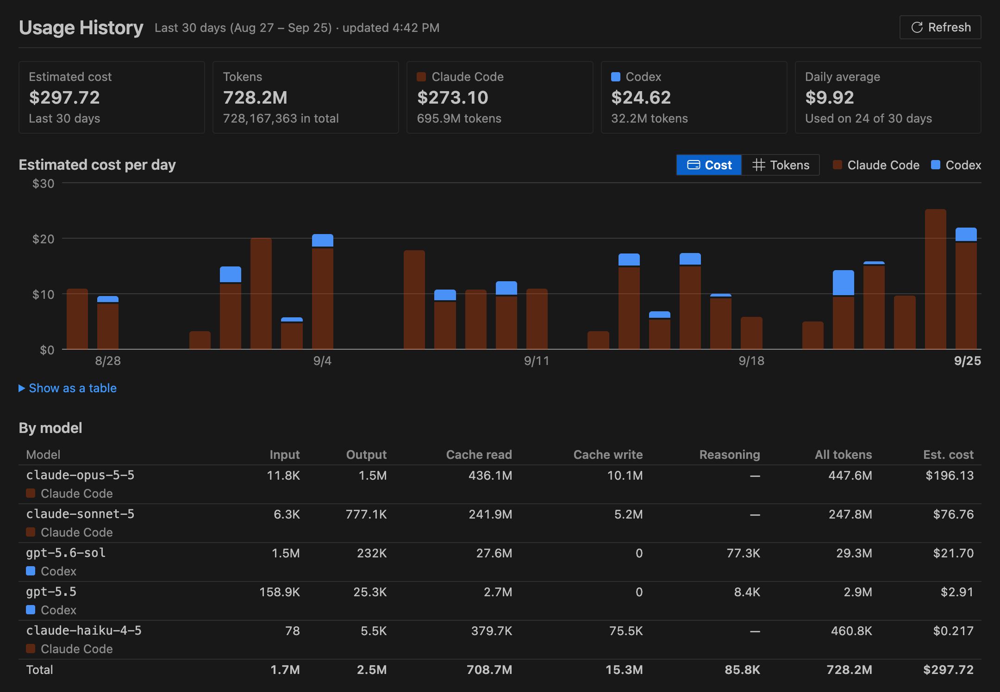

# CYUNEO Agent Monitor 전체 가이드

[English](GUIDE.md) · [简体中文](GUIDE.zh-CN.md) · [繁體中文](GUIDE.zh-TW.md) · **한국어** · [日本語](GUIDE.ja.md)

[← README로 돌아가기](../README.ko.md)

## 기능

### 터미널처럼 동작하는 패널


- **에이전트 모니터**(영어 UI에서는 Agent Monitor)는 터미널 옆, 하단 패널의 탭으로 열리며 터미널처럼 보입니다: 별도의 뷰 제목 표시줄 없이 하나의 패널입니다. 선택한 채팅의 에이전트가 패널 대부분을 차지하고, 좁은 채팅 목록이 터미널 탭 목록처럼 한쪽에 놓입니다.
- **채팅 목록.** 열려 있거나 최근에 사용한 모든 채팅이 각각 상태등과 함께 표시됩니다. **열림**(Claude Code가 아직 채팅을 열어 두었거나, Codex나 GitHub Copilot Chat이 한 턴을 진행 중인 경우)과 **최근**으로 그룹화됩니다. 행 높이는 터미널 탭과 같고, 선택한 채팅은 강조 표시됩니다. 제목이 잘 보이도록 각 행에는 상태등과 제목만 표시됩니다. 컨텍스트가 커서 처리할 가치가 있을 때는 제목 뒤에 작은 표시가 붙습니다: **◔** 압축을 고려하세요, **◕** 곧 처리하세요. 행에 마우스를 올리면 상태, 컨텍스트 등 자세한 내용을 볼 수 있습니다.
- **목록은 터미널 탭 목록이 있는 쪽에 놓입니다**(기본값은 오른쪽이며 `terminal.integrated.tabs.location`을 따릅니다). `agentMonitor.sessionListPosition`을 설정해 직접 왼쪽이나 오른쪽으로 바꿀 수 있습니다. 구분선을 드래그해 너비를 조절하고, 두 번 클릭하면 기본값인 200px로 돌아가며, 거의 닫힐 때까지 드래그하면 상태등만 보이는 좁은 막대로 줄어듭니다. 패널이 500px보다 좁으면 자동으로 좁은 막대가 사용됩니다. 너비는 저장됩니다.
- **채팅에 마우스를 올리면** **압축…** 버튼(컨텍스트가 20K 이상일 때)과 오른쪽 클릭 메뉴와 같은 작업을 담은 **…** 버튼이 나타납니다. 키보드도 사용할 수 있습니다: 화살표 키, Home, End로 목록을 이동하고, Enter나 Space로 선택하고, 문자를 입력하면 첫 글자로 채팅을 찾아가며, Shift+F10으로 작업 메뉴를 엽니다.
- **에이전트.** 채팅을 클릭하면 그 안에서 무엇이 실행 중인지 볼 수 있습니다: 맨 위에 메인 대화, 그다음 서브에이전트와 백그라운드 에이전트, 워크플로 에이전트는 해당 워크플로 아래에 묶여 표시됩니다.
- **채팅 헤더는 두 줄뿐이라** 패널이 낮아도 에이전트가 바로 보입니다. 첫 줄에는 제목이 있고 **이동**과 **압축…** 옆에 컨텍스트 사용률("컨텍스트 41%")이 표시됩니다. 둘째 줄에는 상태, 자동 압축 지점 대비 컨텍스트, 힌트, 캐시 남은 시간, 이 채팅의 비용이 표시됩니다. 나머지(컨텍스트 막대, 자동 압축 설정, 오늘 합계, 알림, 재개 프롬프트, 트랜스크립트 행)는 **자세히 ▸** 안에 있습니다. 사용량 한도, API 오류, 압축 루프처럼 급한 문제가 있을 때만 한 줄이 더 생깁니다. 에이전트 표의 머리글은 스크롤해도 맨 위에 고정되며, 패널 높이가 400px 미만이면 비용과 시간 열이 숨겨집니다.
- Claude Code나 Codex 채팅 탭으로 전환하면 목록에서 해당 채팅이 자동으로 선택됩니다. 이는 탭을 전환할 때만 발생하며 새로고침할 때는 발생하지 않으므로 선택 상태가 유지됩니다.
- 사이드바에는 **개요** 트리도 있고, 상태 표시줄에는 개수가 표시된 상태등이, 그리고 확인이 필요한 채팅 수를 보여주는 배지도 있습니다.

### 상태등

같은 여섯 가지 표시등이 세션 목록, 에이전트 표, 개요, 상태 표시줄, 터미널 버전 어디서나 동일하게 사용됩니다.

| 색 | 의미 |
| --- | --- |
| 마젠타 | **확인 필요**: 승인, 답변, 또는 대화상자를 기다리는 중 |
| 빨강 | **오류**: 사용 한도 또는 API 오류로 중지됨 |
| 파랑 | **작업 중** |
| 밝은 녹색 | **완료(새 결과)**: 완료되었고 아직 확인하지 않음 |
| 어두운 녹색 | **완료**: 완료되었고 이미 확인함 |
| 회색 | **대기**: 중단됨, 중지됨, 또는 최근 활동 없음 |

표시등은 모양도 다르므로(채워짐 또는 윤곽선) 색상에만 의존하지 않습니다. 라이트 테마와 고대비 테마는 각자의 색조를 사용하며, `workbench.colorCustomizations`에서 모든 색을 바꿀 수 있습니다.

실시간 상태를 보고하는 Claude Code 버전("[읽는 내용](#읽는-내용)" 참고)과 GitHub Copilot Chat에서는 "확인 필요"가 정확합니다. 다만 Copilot Chat에서는 최대 1분 정도 늦게 표시될 수 있습니다. 더 오래된 Claude Code 버전과 Codex에서는 확장 프로그램이 추측할 수밖에 없습니다. 빠른 도구(파일 읽기·쓰기·편집, 검색, 패치)가 60초 동안 결과가 없으면 채팅에 **승인 대기 중일 수 있음**이 표시됩니다. 셸 명령 같은 긴 명령은 절대 추측하지 않습니다. `agentMonitor.approvalGuess`로 이 추측을 바꾸거나 끌 수 있습니다.

### 채팅이 실행 중인 곳으로 이동

채팅 헤더의 **이동**을 클릭하거나 목록의 채팅 또는 그 에이전트 중 하나를 두 번 클릭하면, 에이전트 모니터가 그 채팅이 실행 중인 곳을 띄워 줍니다. 한 번 클릭은 지금처럼 채팅을 선택하거나 에이전트의 자세한 내용을 보여 줄 뿐입니다. **대화로 이동**은 채팅의 우클릭 메뉴와 **…** 메뉴, 사이드바 개요의 우클릭 메뉴(채팅 행에는 인라인 버튼도 있음), 명령 팔레트에도 있습니다.

| 채팅이 실행되는 곳 | 동작 |
| --- | --- |
| Claude Code 확장 | Claude Code에서 채팅이 열리며, `claudeCode.preferredLocation` 설정에 따라 탭이나 사이드바에 표시됩니다. 이 설정은 바뀌지 않습니다 |
| Codex 확장 | 대화가 편집기 탭에서 열립니다 |
| GitHub Copilot Chat | 채팅이 속한 작업 영역의 창에서 편집기 탭으로 열립니다 |
| VS Code 통합 터미널의 Claude Code 또는 Codex | 그 터미널이 표시됩니다 |
| 다른 VS Code 창 | 그 창이 채팅을 열거나 터미널을 표시하고 앞으로 나옵니다. `agentMonitor.shareScanAcrossWindows`가 켜져 있어야 합니다(기본값). 그 창이 앞으로 나오지 못하면 어느 창으로 전환할지 메시지로 알려 줍니다 |
| macOS의 Terminal.app 또는 iTerm2 | 그 앱이 앞으로 나오고 채팅의 탭이 선택됩니다(아래 참고) |
| Claude 또는 Codex 데스크톱 앱, 다른 터미널 앱(Warp, Ghostty, WezTerm, kitty, Alacritty, Windows Terminal 등) | 아직 지원하지 않으며, 메시지로 알려 줍니다 |

- **Terminal.app과 iTerm2:** 처음에는 에이전트 모니터가 그 앱에서 이 채팅의 탭으로 전환할지 먼저 묻습니다. **계속**을 선택하면 macOS가 VS Code(또는 사용 중인 편집기)가 그 앱을 제어해도 되는지 묻습니다. 허용을 선택하세요. 앱마다 한 번만 묻습니다. 허용하지 않았다면 다음에 시도할 때 **자동화 설정 열기** 버튼이 있는 메시지가 나타납니다. 시스템 설정 > 개인정보 보호 및 보안 > 자동화에서 허용한 뒤 다시 시도하세요. 나중에 그곳에서 바꿀 수도 있습니다.
- **Codex CLI:** 이 채팅들에는 쓸 수 있는 프로세스 ID가 없어서, 에이전트 모니터는 채팅의 폴더에서 실행 중인 `codex` 프로세스를 찾습니다(어느 프로세스가 채팅의 기록 파일을 열고 있는지 알 수 있으면 그 프로세스를 씁니다). 같은 폴더에서 여러 개가 실행 중이면 가장 최근에 시작된 것을 고르며, 그것이 다른 채팅일 수도 있습니다. Windows에서는 프로세스의 폴더를 읽을 수 없어 가장 최근 것을 고릅니다.
- **이동할 수 없을 때는** 이유를 메시지로 알려 줍니다. 예를 들어 채팅이 더 이상 실행 중이 아니거나, VS Code 밖의 터미널에서 실행 중이거나, 터미널이나 대화 패널이 아니라 다른 도구나 에이전트가 시작했거나, 그 Copilot 채팅의 작업 영역을 연 VS Code 창이 없는 경우입니다.
- **이동 버튼**(과 개요의 인라인 버튼)은 이동할 수 있을 가능성이 높을 때만 나타납니다: 아직 열려 있는 Claude Code 채팅, 그리고 열려 있거나 최근 24시간 안에 활동한 Codex와 Copilot Chat 채팅입니다. 두 번 클릭과 메뉴는 항상 시도합니다.
- **요청할 때만 확인합니다.** 에이전트 모니터는 이동을 사용할 때만 실행 중인 프로세스 목록을 가져옵니다: macOS와 Linux에서는 `ps`를 한 번, Windows에서는 PowerShell을 한 번 호출합니다. Codex CLI는 프로세스의 작업 폴더와 어느 프로세스가 채팅의 기록 파일을 열고 있는지도 확인합니다(macOS는 `lsof`, Linux는 `/proc`). 이를 위해 채팅 내용을 읽지 않으며, 어디로도 보내지 않습니다. 다른 VS Code 창과는 [읽는 내용](#읽는-내용)에서 설명한 공유 폴더를 통해 연락합니다.

### "확인 필요" 알림

- 채팅이나 그 안의 에이전트가 사용자를 기다리기 시작하면(승인, 답변, 대화상자, 그리고 추측한 **승인 대기 중일 수 있음** 포함) 에이전트 모니터가 알려 줍니다. 포커스가 있는 VS Code 창에서는 **보기** 버튼이 있는 메시지를 표시하며, 버튼을 누르면 패널에서 해당 채팅을 선택합니다. 현재 범위에서 보이지 않는 채팅이면 다른 채팅을 선택하거나 범위를 바꿀 때까지 이 창의 목록에 추가되며, 범위 설정 자체는 바뀌지 않습니다. 지금 보고 있는 채팅(탭이 활성화되어 있거나 패널에 표시 중인 채팅)에 대해서는 메시지를 표시하지 않습니다.
- 포커스가 있는 VS Code 창이 없으면 대신 시스템 알림을 표시합니다(macOS, Linux). Windows와 원격 창(SSH, WSL, 컨테이너)에서는 채팅이 아직 기다리고 있으면 다음에 전환하는 VS Code 창에 메시지가 표시됩니다.
- 창을 몇 개 열어 두든 대기 하나당 한 번, 한 창에서만 알리며, 이 확장 프로그램을 설치한 여러 편집기(VS Code, VS Code Insiders, Cursor 등) 사이에서도 마찬가지입니다. 창을 열었을 때 이미 기다리고 있던 채팅이나, 설정을 바꿔서 새로 보이게 된 채팅(예: Codex를 켠 경우)은 알리지 않습니다. 창의 범위 밖에 있는 채팅도 알림 대상입니다.
- `agentMonitor.notifyNeedsYou`로 알림을 끌 수 있습니다. 포커스가 있는 VS Code 창이 없는 동안에는 기록을 2초가 아니라 5초마다 읽습니다(`agentMonitor.backgroundRefreshSeconds`). 시스템 알림을 보내기 전에 기록을 한 번 더 읽으므로 이미 답한 요청은 알리지 않습니다. 그래서 알림이 몇 초 늦게 올 수 있습니다.
- 응답하지 못했을 때 휴대폰으로도 메시지를 받으려면 [휴대폰이나 팀 채팅으로 푸시](#휴대폰이나-팀-채팅으로-푸시)를 참고하세요. 소리로도 알림을 받으려면 [알림음](#알림음)을, 밤에는 조용히 두려면 [방해 금지 시간](#방해-금지-시간)을 참고하세요.

### 휴대폰이나 팀 채팅으로 푸시

선택 기능이며 **기본값은 꺼짐**입니다. 켜면 다음과 같은 경우 에이전트 모니터가 휴대폰이나 팀 채팅으로 짧은 메시지를 보낼 수 있습니다.

- **에이전트가 나를 기다리고**, `agentMonitor.push.delaySeconds`(기본 30초)가 지나도 계속 기다릴 때. 데스크톱 알림이 먼저 표시되며, 그 사이에 응답하면 푸시하지 않습니다. 기다리는 동안 컴퓨터가 잠자기 상태가 되면, 깨어난 뒤에 그 대기를 푸시하지 않습니다.
- **에이전트가 API 오류로 멈췄을 때**(바로 보냄).
- **Claude Code 또는 Codex 사용 한도에 도달했을 때**, 그리고 **한도가 초기화될 때**.
- **임계값 알림이 왔을 때**: 사용량, 오늘 비용 또는 채팅의 컨텍스트가 정해 둔 값을 넘었을 때입니다([임계값 알림](#임계값-알림) 참고). 이벤트 이름은 `usageHigh`, `costDaily`, `contextHigh`입니다.

모두 기본적으로 켜져 있습니다(비용과 컨텍스트 알림은 기준값을 정해야 옵니다). 설정 메뉴의 **이벤트 선택…** 또는 `agentMonitor.push.events`로 고를 수 있습니다. [방해 금지 시간](#방해-금지-시간)에는 푸시하지 않으며, 오류를 허용한 경우 API 오류와 사용 한도 도달만 푸시합니다.

**네트워크 접근:** 네트워크를 쓰는 기능은 푸시뿐이므로 **네트워크 접근 허용**(`agentMonitor.network.allow`, 기본값은 꺼짐)도 켜야 합니다. 꺼져 있는 동안에는 테스트 메시지를 포함해 아무것도 보내지 않으며, 설정 메뉴에 푸시가 **일시 중지됨**으로 표시됩니다. 꺼진 상태에서 채널을 추가하거나 푸시를 켜거나 테스트 메시지를 보내면 무엇을 어디로 보내는지 알려 주는 대화 상자가 먼저 뜨고, 그 안의 **네트워크 접근 허용** 버튼을 눌러야만 켜집니다. 다시 끄려면 **네트워크 접근 차단**(설정 메뉴, 패널의 **…** 메뉴 또는 명령 팔레트)을 사용하세요. 푸시는 켜진 채로 남고, 다시 허용해도 그사이에 있었던 일은 보내지 않습니다. 네트워크 접근 허용은 이 컴퓨터에만 적용되며, 설정 동기화로 다른 컴퓨터에 옮겨지지 않습니다.

**보내는 내용:** 프로젝트 폴더 이름과 상태입니다(예: "에이전트 확인 필요 · my-app"). 사용 한도의 경우 제품 이름과 초기화 시각입니다. 임계값 알림의 경우 무엇이 기준을 넘었는지를 보냅니다. 사용량 기간과 그 비율, 오늘 비용이 예산을 넘었다는 사실(금액은 보내지 않음), 또는 채팅의 컨텍스트 비율입니다. `agentMonitor.push.includeTitle`을 켜면 대화 제목(과 하위 에이전트 이름)이 더해지는데, 직접 정했거나 에이전트·앱이 만든 실제 제목만 보냅니다. 첫 프롬프트로 만든 제목은 절대 보내지 않습니다. 확장 프로그램은 프롬프트, 코드, 파일 경로, 토큰 수, 비용을 덧붙이지 않지만, 제목과 하위 에이전트 이름은 쓰인 그대로 보내므로 파일 이름이 들어 있을 수 있습니다.

**설정 방법:** 명령 팔레트나 패널 제목 표시줄의 **…** 메뉴에서 **에이전트 모니터: 푸시 알림…**을 실행하고 **푸시 채널 추가**를 고릅니다. 서비스를 고르고, 개인정보 안내(서비스마다 한 번만 표시)를 읽고, 각 항목을 입력한 뒤 테스트 메시지를 보냅니다. 토큰, 키, 웹후크 URL은 VS Code 보안 저장소에 보관되며 `settings.json`에는 절대 들어가지 않습니다. 채널을 편집할 때 비밀 값 항목을 비워 두면 저장된 값이 유지되고, 선택 항목인 비밀 값(ntfy 액세스 토큰, Feishu나 DingTalk 서명 시크릿)은 `-`만 입력하면 삭제됩니다. 비밀 값은 컴퓨터 사이에 동기화되지 않습니다. 설정 동기화를 쓰면 다른 컴퓨터에서 추가한 채널은 이 컴퓨터에서도 설정할 때까지 **이 컴퓨터에는 아직 설정되지 않음**으로 표시되고, 채널을 삭제하면 삭제한 컴퓨터의 비밀 값만 지워집니다(다른 컴퓨터에 남은 값은 다시 쓰이지 않습니다). 직접 운영하는 ntfy나 Bark 서버에는 localhost와 사설 네트워크 주소일 때만 `http://`를 쓸 수 있습니다. 암호화되지 않고, 다른 네트워크(카페, 호텔)에서는 같은 주소가 다른 사람의 기기일 수 있으니 직접 관리하는 네트워크의 서버에만 쓰세요. 같은 메뉴에서 푸시가 켜져 있는지, 사용 중인 채널 수, 네트워크 접근이 허용되었는지를 보고, 테스트 메시지 보내기, 채널 편집·끄기·삭제, 푸시 켜기·끄기, 이벤트 선택, 네트워크 접근 허용·차단을 할 수 있습니다.

| 서비스 | 준비할 것 |
| --- | --- |
| **ntfy** | ntfy 앱을 설치하고 설정 중에 제안하는 토픽을 구독합니다. ntfy.sh에서는 토픽을 아는 사람은 누구나 읽을 수 있으므로 토픽은 무작위로 만들어집니다. 직접 운영하는 서버와 액세스 토큰도 쓸 수 있습니다. |
| **Bark**(iPhone) | Bark 앱의 기기 키: 예시 URL에서 서버 주소 바로 뒤에 오는 부분입니다. |
| **ServerChan**(위챗) | sct.ftqq.com에서 받은 SendKey(`SCT…`, ServerChan³은 `sctp…`). 무료 요금제는 하루 5건만 보낼 수 있으므로 이 채널의 일일 한도는 5로 시작합니다. |
| **Feishu / Lark** | 그룹에 사용자 지정 봇을 추가하고 웹후크 URL을 복사합니다. 서명 검증을 켰다면 시크릿을, 키워드를 쓴다면 그중 하나를 입력합니다. |
| **DingTalk** | 그룹에 사용자 지정 로봇을 추가하고 웹후크 URL을 복사합니다. 보안 설정이 서명이면 시크릿(`SEC`로 시작)을, 사용자 지정 키워드면 키워드 하나를 입력합니다. |
| **WeCom** | 그룹 로봇을 추가하고 웹후크 URL을 복사합니다. |
| **Telegram** | @BotFather로 봇을 만들고 토큰과 내 Chat ID를 입력합니다. 봇은 먼저 대화를 시작할 수 없으므로 봇에게 먼저 메시지를 보내 두세요. |
| **Discord** | 채널 설정의 연동 > 웹후크에서 웹후크를 만들고 URL을 복사합니다. |
| **Slack** | 채널용 수신 웹후크를 만들고 URL을 복사합니다. |

**한도:** 몇 초 안에 잇따라 생긴 업데이트는 메시지 하나로 묶어서 보냅니다. 채널마다 최대 10초에 한 건, 시간당 20건이며, **일일 한도**를 정했다면(0은 제한 없음) 그것도 지킵니다. 시간당 한도나 일일 한도를 넘는 메시지는 나중에 보내지 않고 건너뛰며, 에이전트 모니터 출력에 기록됩니다. 한도는 모든 창을 합쳐 계산하고, 이벤트 하나는 한 창에서만 보냅니다. 채널이 연속으로 세 번 실패하면 **푸시 설정 열기** 버튼이 있는 경고를 한 번 표시하며, 그 채널로 다시 전송에 성공할 때까지 반복하지 않습니다.

**원격 창:** 푸시는 확장 프로그램이 실행되는 컴퓨터에서 보냅니다. 원격 창(SSH, WSL, 컨테이너)에서는 원격 컴퓨터이므로 그 컴퓨터가 해당 서비스에 접속할 수 있어야 합니다. 채널의 비밀 값도 그 컴퓨터에서 쓰이므로(VS Code가 그곳의 확장 프로그램에 넘겨줍니다), 푸시가 켜져 있는 동안에는 신뢰하는 컴퓨터에서만 원격 창을 열거나 먼저 푸시를 끄세요.

**프록시:** 푸시는 VS Code를 통해 나가므로, VS Code가 프록시 설정을 확장 프로그램에 넘겨주는 경우(`http.fetchAdditionalSupport`, 최근 버전은 기본값이 켜짐) VS Code에서 설정한 프록시(`http.proxy`)가 적용됩니다. 프록시 환경에서 푸시가 실패하면 이 설정들을 확인하세요.

### 알림음

선택 기능이며 **기본값은 꺼짐**입니다. `agentMonitor.sound.enabled`를 켜면 다음과 같은 경우 에이전트 모니터가 짧은 소리를 냅니다.

- **에이전트가 나를 기다릴 때**(`agentMonitor.sound.needsYou`)
- **에이전트가 오류로 멈췄을 때**(API 오류나 사용 한도 도달 포함, `agentMonitor.sound.error`)
- **채팅이 끝났는데 아직 확인하지 않았을 때**, 즉 표시등이 밝은 녹색 **완료(새 결과)**로 바뀔 때(`agentMonitor.sound.done`)
- **임계값 알림이 왔을 때**(`agentMonitor.sound.alert`, [임계값 알림](#임계값-알림) 참고)

각 설정에는 `default`, `off`, 또는 Glass, Ping, Pop, Tink, Submarine, Funk, Hero, Basso 중 하나를 지정할 수 있습니다. `default`는 경우마다 다른 소리를 씁니다. 에이전트가 기다릴 때는 Glass, 오류는 Basso, 완료는 Hero, 임계값 알림은 Funk입니다. 이 이름들은 macOS 시스템 사운드이며 `afplay`로 재생합니다. Linux에서는 시스템 사운드 테마에서 비슷한 소리를 `canberra-gtk-play`나 `paplay`로 재생하며, 둘 중 하나가 설치되어 있어야 합니다. Windows에서는 Windows `Media` 폴더에서 비슷한 소리를 재생합니다. "확인 필요" 소리는 ["확인 필요" 알림](#확인-필요-알림)과 함께 울리므로 `agentMonitor.notifyNeedsYou`도 켜져 있어야 합니다. 지금 보고 있는 채팅에는 "확인 필요" 소리도 "완료" 소리도 나지 않으며, 완료가 추측일 뿐일 때도 "완료" 소리가 나지 않습니다. 소리는 한 VS Code 창에서만 나며, 여러 일이 한꺼번에 일어나도 한 번만 납니다. 모든 창을 통틀어 3초에 한 번이 최대입니다. 원격 창(SSH, WSL, 컨테이너)과 [방해 금지 시간](#방해-금지-시간)에는 소리가 나지 않습니다.

### 방해 금지 시간

선택 기능이며 **기본값은 꺼짐**입니다. `agentMonitor.quietHours.enabled`를 켜면 정해 둔 시간 동안에는 다음과 같이 동작합니다.

- 알림음을 재생하지 않습니다.
- 시스템 알림을 보내지 않습니다. 메시지는 기다렸다가 다음에 전환하는 VS Code 창에 표시됩니다.
- 휴대폰이나 팀 채팅으로 푸시하지 않으며, 방해 금지 시간에 있었던 일을 나중에 보내지도 않습니다.

포커스가 있는 VS Code 창의 메시지는 그대로 표시되고, 패널, 상태등, 배지, 상태 표시줄도 평소대로 갱신됩니다. 방해 금지 시간이 적용되는 동안에는 상태 표시줄 툴팁에서 확인할 수 있습니다.

- `agentMonitor.quietHours.start`와 `agentMonitor.quietHours.end`는 24시간제 `HH:MM` 형식의 현지 시각이며 기본값은 22:00과 08:00입니다. 끝나는 시각이 시작 시각보다 이르면 자정을 넘어 이어집니다. 두 값이 같으면 방해 금지 시간은 적용되지 않습니다.
- `agentMonitor.quietHours.days`로 특정 요일에만 적용할 수 있습니다: `sun`, `mon`, `tue`, `wed`, `thu`, `fri`, `sat`. 비워 두면(기본값) 매일 적용됩니다. 기준은 방해 금지 시간이 시작되는 요일입니다. `["fri"]`로 설정하면 금요일 22:00부터 토요일 08:00까지가 방해 금지 시간입니다.
- `agentMonitor.quietHours.allowErrors`를 켜면 API 오류와 사용 한도 도달 때는 방해 금지 시간에도 오류 알림음이 울리고 푸시도 보냅니다. 한도 초기화와 임계값 알림은 그래도 조용합니다.

### 임계값 알림

어떤 수치가 정해 둔 값을 넘으면 에이전트 모니터가 알려 줄 수도 있습니다. 알림 방식은 "확인 필요" 알림과 같습니다(포커스가 있는 VS Code 창에는 메시지, 포커스가 있는 창이 없으면 시스템 알림). 알림음을 켜 두었다면 임계값 알림 소리가 나고, 푸시를 켜 두었다면 푸시도 보냅니다.

| 설정 | 기본값 | 알리는 때 |
| --- | --- | --- |
| `agentMonitor.alerts.usagePercent` | `90` | Codex의 5시간 또는 주간 사용량이 이 비율에 도달했을 때. Codex 전용입니다. Claude Code의 로컬 로그에는 한도에 도달한 사실만 남고 비율은 남지 않습니다 |
| `agentMonitor.alerts.dailyCost` | `0`(꺼짐) | 오늘의 예상 API 환산 비용(Claude Code와 Codex 합계)이 이 금액(미국 달러)에 도달했을 때 |
| `agentMonitor.alerts.contextPercent` | `0`(꺼짐) | 채팅의 메인 대화가 자동 압축 지점의 이 비율에 도달했을 때(Claude Code와 Codex. GitHub Copilot Chat에는 자동 압축 지점이 없습니다) |

- 알림은 한 번씩만 옵니다. 사용량은 한도가 초기화될 때까지 기간마다 한 번, 비용은 하루에 한 번, 컨텍스트는 채팅마다 다음 압축 전까지 한 번입니다. 값을 0으로 하면 해당 알림이 꺼집니다.
- 창을 열 때나 설정을 바꿀 때 이미 기준을 넘어 있던 것은 알리지 않습니다.
- 알림 하나는 한 창에서만 표시합니다.
- 비용은 공개 가격 기준 추정치이며([사용량과 비용](#사용량과-비용) 참고), "오늘"은 컴퓨터의 현지 시각을 따릅니다.
- 푸시를 켜 두면 이 알림도 푸시합니다([휴대폰이나 팀 채팅으로 푸시](#휴대폰이나-팀-채팅으로-푸시) 참고). 비용 알림을 푸시할 때는 오늘 비용이 예산을 넘었다는 사실만 보내고 금액은 보내지 않습니다.

### 순서가 흔들리지 않음

- 채팅은 시작 시각 기준 최신순으로 정렬됩니다. 에이전트는 시작 시각 기준 오래된 순으로 정렬됩니다.
- 활동, 상태, 토큰 수로 재정렬되는 일은 절대 없습니다. 에이전트가 끝나도 그 자리에 그대로 있고 표시등 색만 바뀝니다.
- 채팅은 **열림**과 **최근** 사이를 오갈 때만 위치가 바뀝니다. 에이전트 표는 행을 제자리에서 업데이트하므로 스크롤 위치와 펼친 행이 그대로 유지됩니다.

### 모델 선택과 비용 추정이 있는 압축 버튼


컨텍스트가 20K 토큰 이상인 모든 Claude Code 또는 Codex 채팅에는 **압축…** 버튼이 생깁니다. 채팅 목록에서 마우스를 올렸을 때 그 행에도, 에이전트 위쪽의 채팅 헤더에도 있습니다. 선택하기 전까지는 아무것도 실행되지 않습니다.

- **Claude Code 채팅이 열려 있을 때:** 확장 프로그램이 그 채팅으로 전환하고 입력창에 `/compact`를 넣은 뒤, 요약이 반드시 유지해야 할 내용(목표, 결정, 미해결 문제, 파일 경로, 사용자가 말한 제약)을 담은 템플릿을 이어 붙입니다. 이 텍스트는 클립보드에도 복사됩니다. 원하면 편집한 뒤 직접 Enter를 누르세요.
- **Claude Code 채팅이 닫혀 있을 때:** 확장 프로그램이 로컬 Claude Code로 백그라운드에서 압축할 수 있으며, 모델을 직접 고를 수 있습니다:
  - 채팅이 원래 사용하던 모델;
  - Claude Sonnet 5;
  - Claude Haiku 4.5, 컨텍스트가 200K 창에 들어갈 때만 선택 가능.

  각 옵션에는 예상 비용이 표시되고, 가장 저렴한 것에 **추천** 표시가 붙습니다. 실행 전에 확인 대화상자가 먼저 뜹니다(끌 수 있습니다). 실제로 실행하기 직전에 확장 프로그램이 한 번 더 확인해서, 채팅이 다시 열려 있으면 중지합니다.
- **추정치는 프롬프트 캐시 상태를 반영합니다.**
  - 캐시가 아직 유효한 동안에는 같은 모델로 압축하는 것이 가장 저렴합니다.
  - 캐시가 만료되면 더 저렴한 모델로 바꾸는 것이 약 절반 비용입니다.
  - 예를 들어 Claude Opus 5.5 세션에 컨텍스트가 400K 토큰이라면: 캐시가 유효할 때 약 $0.40; 1시간 캐시가 만료된 후에는 같은 모델로 약 $3.52, Sonnet 5로는 약 $1.76.
- **메뉴에는 이런 항목도 있습니다:** **인수인계 메모 작성**, 새 작업으로 전환할 때 유용합니다. 그런 경우 압축보다 새 세션이 더 낫습니다.
- **알림**(각각 끌 수 있음):
  - 대형 유휴 채팅의 프롬프트 캐시가 만료되기 직전, 또는 대형 채팅을 닫을 때, 압축이 아직 저렴한 동안 알려줍니다;
  - 압축 후에는 주요 규칙이 여전히 유지되고 있는지 확인하도록 알려줍니다.
- **Codex 채팅:** 확장 프로그램이 Codex에서 대화를 열고 `/compact`를 복사해 붙여넣을 수 있게 해줍니다.
- **압축 횟수:** **자세히** 안에 **N회 압축됨**(자동 + 수동)이 표시됩니다. 두 번 이상 압축한 뒤 컨텍스트가 다시 커지고 있다면 인수인계 메모를 쓰고 새로 시작하라고 제안합니다. 채팅이 10분 안에 두 번 압축되었거나 압축 직후 바로 "곧 처리하세요" 구간에 다시 들어가면 오류 색으로 **압축 루프에 빠졌을 수 있음**이 표시됩니다. "두 번"은 측정된 한계가 아니라 경험적인 기준입니다.

### 자동 압축 용량 직접 설정하기

Claude Code는 컨텍스트가 특정 용량에 도달하면 스스로 압축합니다. 이는 작업 중에 일어나므로 캐시가 유효하고 압축 자체도 저렴합니다. 사용자가 고를 수 있는 것은 *용량을 얼마로 설정할지*입니다. 채팅의 **자세히** 안에 있는 **자동 압축: … ▾**를 클릭하거나, 채팅을 마우스 오른쪽 버튼으로 클릭해 **자동 압축 임계값 설정…**을 선택하세요.

- 목록은 각 사전 설정을 그 채팅의 모델에 맞는 용량(백분율과 토큰 수)으로 환산해서 보여주고, 실제로 대략 어디에서 압축될지, 근거가 얼마나 탄탄한지, 그리고 "호출당 약 $0.069, 기본값보다 45% 저렴" 같은 추정치를 함께 보여줍니다. **사용자 지정…**은 100K에서 1M 사이의 어떤 값이든 받아들이며, **참고 가이드 보기**는 이 수치들의 근거가 된 자료를 엽니다.
- **모든 프로젝트:** 채팅이 열려 있으면 확장 프로그램이 그 채팅에 `/autocompact <값>`을 채워 넣습니다. Enter를 누르면 Claude Code가 즉시 적용하고 사용자 설정에 저장합니다. 채팅이 닫혀 있으면 확장 프로그램이 `~/.claude/settings.json`에 `autoCompactWindow`를 씁니다.
- **이 프로젝트만:** 확장 프로그램이 `<프로젝트>/.claude/settings.local.json`에 `autoCompactWindow`를 쓰며, 이는 사용자 설정보다 우선합니다. 새 세션에는 적용되며, 열려 있는 세션은 다시 열어야 할 수 있습니다.
- 확장 프로그램이 설정 파일에 쓸 때는 그 키 하나만 바꾸고, 기존 서식을 유지하며, 쓰기 전에 백업을 남기고, 파일을 파싱할 수 없으면 아예 쓰지 않습니다. **기본값 유지**를 선택하면 그 키가 삭제됩니다.
- **Codex:** 확장 프로그램은 `config.toml`을 수정하지 않습니다. `model_auto_compact_token_limit = 217600` 같은 줄을 복사해 `~/.codex/config.toml`을 열고, 파일 맨 위, 어떤 `[테이블]` 앞에 붙여넣도록 안내합니다.

"조사에는 X%, 코딩에는 Y%"처럼 표준 답을 제시한 공급업체나 논문은 없습니다. 아래 사전 설정들은 공급업체 기본값, 공급업체 벤치마크 설정, 실무자 데이터, 비용 모델 사이의 절충안이며, 근거 열에 각각이 얼마나 탄탄한지 표시되어 있습니다.

| 사전 설정 | 1M 창 모델: 설정값 → 대략 압축 지점 | 200K 창 모델 | Codex | 호출당(Opus 5.5, 1M) / 기본값 대비 | 근거 |
| --- | --- | --- | --- | --- | --- |
| **기본값 유지**(신경 쓰고 싶지 않은 사람에게) | 설정 안 함 → 약 967K | 설정 안 함 → 약 167K | 90%(약 245K) | $0.126 / 100% | 강함: 공급업체 기본값, 공식적으로 강력히 권장됨 |
| **코딩(균형)** | 400K(40%) → 약 367K | 설정 안 함 | 90% | $0.069 / 약 55% | 중간: 한 실무자가 관찰한 873건의 압축 데이터(코드 작성/이해 시 300–450K)와 실무 경험. 대조 실험은 없음 |
| **리서치 / 검색** | 250K(25%) → 약 217K | 160K(80%) → 약 127K | 80% | $0.056 / 약 44% | 중간: Anthropic 자체 검색 벤치마크 설정은 200K에서 트리거됨; DeepSeek-V3.2와 Kimi K2.5는 창의 80%에서 트리거됨. 위험: 원래 질문을 잃기 쉬우므로 파일에 적어 둘 것 |
| **장시간 자율 실행** | 600K(60%) → 약 567K | 설정 안 함 | 90% | $0.088 / 약 70% | 약함: 직접적인 근거 없는 절충안. 가장 중요한 것은 목표와 제약을 파일에 적는 것 |
| **비용 최우선** | 200K(20%) → 약 167K | 설정 안 함(낮춰도 절약되지 않음) | 80% | $0.052 / 약 41% | 중간: 비용 모델과 같은 실무자의 비용 최적점(약 220K). 대가: 압축 횟수가 기본값의 약 7배, 정보 손실이 가장 큼 |

- **설정한 값이 실제 압축 지점은 아닙니다.** 실제로는 약 33K 더 일찍 압축됩니다(공식 발표인 "1M에서 약 967K에 압축"에서 추정), 그래서 "400K"는 실제로 약 367K에서 압축된다는 뜻입니다.
- **200K 창 모델에서는 임계값을 낮춰도 절약되는 비용이 거의 없습니다**(호출당 약 3%), 그러니 품질을 위해서만 하세요. 설정값은 100K 아래로 내려갈 수 없어서, 이런 모델은 50%–100%만 사용할 수 있습니다.
- **모든 모델에 값 하나가 적용됩니다.** 같은 범위 안에서 1M 모델과 200K 모델을 오간다면 더 작은 창이 상한이 됩니다.
- **압축할 때마다 세부 정보가 사라집니다.** 오래 유지할 규칙은 `CLAUDE.md`에 적고, 다른 작업이라면 압축 대신 새 세션을 시작하세요.
- **비용 모델:** 캐시는 계속 유효하고, 호출마다 약 3K 토큰이 추가되며, 압축 후 약 30K가 남고, 요약은 압축 지점의 약 4%(2K–20K)입니다. 가격은 그 채팅의 모델을 기준으로 합니다.
- **Claude Code 자체의 설명:** "The auto setting picks a window tuned for your model and is strongly recommended for the best cost and performance. Overriding auto may result in high token usage, especially when resuming long sessions."(auto 설정은 모델에 맞게 조정된 창을 선택하며, 최상의 비용과 성능을 위해 강력히 권장됩니다. auto를 재정의하면 특히 긴 세션을 재개할 때 토큰 사용량이 많아질 수 있습니다.) 이유는 설명되어 있지 않습니다. 가능한 원인: 새 임계값보다 이미 큰 오래된 채팅을 재개하면 캐시가 식은 채로 즉시 압축되고; 임계값이 채팅이 시작할 때의 크기와 너무 가까우면 계속 반복해서 압축되며; 요약에서 사라진 세부 정보 때문에 파일을 다시 읽는 추가 호출이 필요할 수 있습니다.
- Claude Code에 `CLAUDE_CODE_AUTO_COMPACT_WINDOW`가 설정되어 있으면 이 모든 설정보다 우선합니다.

출처를 포함한 전체 참고 자료(다른 도구들의 기본값, 공급업체 벤치마크, 블로그 조언, 비용 모델)는 [docs/compaction-threshold-guide.md](compaction-threshold-guide.md)(영어)에 있습니다.

### 상세 정보

에이전트를 클릭하면 최근 단계, 최종 결과(복사 버튼 포함), 변경한 파일(클릭하면 열림), 도구 오류를 볼 수 있습니다. **트랜스크립트 열기**는 원본 세션 기록을 엽니다.

**자세히** 안에는 **트랜스크립트** 행도 있습니다: 채팅이 저장된 위치(홈 폴더는 `~`로 줄여서 표시), 트랜스크립트와 서브에이전트, 파일 백업의 크기, 그리고 **Finder에서 표시**(Windows에서는 파일 탐색기) 및 **경로 복사** 버튼.

### 사용량과 비용

- **컨텍스트:** 자동 압축 지점 대비 얼마나 사용했는지(예: "412K / 967K 자동 압축"), 모델 창 대비 백분율("1M 창의 41%"), 그리고 자동 압축까지 얼마나 남았는지. 채팅이 자동 압축에 가까워질수록 막대가 채워집니다.
- **백분율과 창 크기는 Claude Code와 Codex 자체의 값을 그대로 사용합니다.** 백분율은 Claude Code 자체 공식을 사용합니다: 컨텍스트 토큰 수(가장 최근 호출의 입력 + 캐시 쓰기 + 캐시 읽기) ÷ 컨텍스트 창, 반올림. 창 크기는 그 세션의 Claude Code 비용 기록(모델이 1M 창으로 실행되는지 알 수 있음)에서 가져오고, 없으면 모델의 표준 창을 사용합니다. Codex는 Codex 로그에서 가져옵니다. 다른 도구는 [지원 도구](#지원-도구)를 참고하세요.
- **자동 압축이 어디서, 왜 일어나는지:** 설정(이 프로젝트의 로컬 설정, 이 프로젝트의 설정, 또는 사용자 설정)에서 순서대로 가져오고, 없으면 **측정값**(그 모델이 마지막으로 자동 압축된 지점, 확장 프로그램이 기억함)을, 그것도 없으면 공식 기본값을 사용합니다. 툴팁에 어떤 것이 적용되는지 나와 있습니다. Claude Code에 `CLAUDE_AUTOCOMPACT_PCT_OVERRIDE`가 설정되어 있으면 표시된 것보다 더 일찍 압축됩니다. 확장 프로그램은 Claude Code의 환경 변수를 볼 수 없습니다.
- **컨텍스트 힌트:** 컨텍스트가 커서 다음 적절한 지점에서 처리할 가치가 있을 때 부드러운 라벨("압축을 고려하세요", "곧 처리하세요")이 나타납니다. 표시등 색은 절대 바꾸지 않습니다.
- **프롬프트 캐시:** 각 Claude Code 채팅의 캐시 카운트다운("캐시: 38분 남음").
- **API 환산 비용:** 각 에이전트, 각 채팅, 그리고 오늘의 합계(Claude Code와 Codex만). Claude Code 채팅의 경우 헤더에 Claude Code 자체의 누적 비용("Claude Code 집계")이 표시됩니다. 그 외에는 모두 토큰 수와 공개 API 가격을 기준으로 추정한 값입니다. 구독 요금제는 이렇게 청구되지 않으므로 비교용으로만 참고하세요. GitHub Copilot Chat은 비용 대신 Copilot credits를 표시합니다([지원 도구](#지원-도구) 참고).

### 사용량 기록

패널 제목 표시줄의 **…** 메뉴나 명령 팔레트에서 **에이전트 모니터: 사용량 기록 보기**를 실행하면 Claude Code와 Codex의 최근 30일 사용량을 보여 주는 페이지가 열립니다(GitHub Copilot Chat은 포함되지 않음).

- 하루별 예상 비용이나 토큰 수를 막대 차트로 보여 줍니다. Claude Code와 Codex는 쌓아서 표시합니다(**비용**과 **토큰** 사이를 전환하거나 **표로 보기**를 선택할 수 있습니다).
- 기간 합계, 일평균, 사용한 날 수를 보여 줍니다.
- **모델별** 내역을 보여 줍니다: 입력, 출력, 캐시 읽기, 캐시 쓰기, 추론, 전체 토큰, 예상 비용.



동작 방식:

- 패널이 읽는 것과 같은 기록으로 사용자의 컴퓨터에서 계산합니다([읽는 내용](#읽는-내용) 참고). 기록은 페이지가 열려 있을 때만 백그라운드에서 읽으며, 페이지를 보고 있는 동안에는 1분마다 갱신됩니다.
- 결과는 확장 프로그램의 저장소에 캐시되므로, 다음에 열 때는 새로 추가된 부분만 읽습니다.
- 비용은 확장 프로그램의 다른 곳과 마찬가지로 공개 가격 기준의 API 환산 추정치입니다. 공개 가격이 없는 모델의 토큰은 비용에서 빠지며, 페이지에 그 토큰 수가 표시됩니다.
- 날짜는 컴퓨터의 현지 시각으로 나눕니다.
- 아직 컴퓨터에 남아 있는 트랜스크립트만 셉니다. Claude Code는 보관 기간(`cleanupPeriodDays`, 기본 30일)이 지난 트랜스크립트를 삭제하므로, 오래된 날은 실제로 쓴 것보다 적게 나올 수 있습니다.

### 사용 한도와 재개

- Claude Code 채팅이 세션, 주간 또는 모델 한도에 도달했을 때와 한도가 언제 초기화되는지 표시합니다.
- Codex의 5시간 및 주간 사용률을 표시합니다.
- Claude Code나 Codex의 채팅 또는 에이전트가 사용 한도, API 오류, 또는 중단으로 멈췄을 때 **재개 프롬프트 복사…**가 바로 쓸 수 있는 프롬프트나 터미널 명령(`claude --resume …`, `codex resume …`)을 복사합니다. 컨텍스트를 다시 읽는 데 드는 비용도 추정해 줍니다.

### 채팅이 저장되는 위치와 이동 방법

프롬프트 캐시는 Anthropic과 OpenAI의 서버에 있으며 사용자 컴퓨터의 공간을 차지하지 않습니다. 실제로 공간을 차지하고 계속 다시 쓰이는 것은 채팅 트랜스크립트, 파일 백업, 플러그인, 로그입니다. 한 테스트 컴퓨터에서 Claude Code 세션 프로세스 하나가 시간당 23–78 MB를 쓰고 14–36 MB를 읽었으며 300–400 MB의 메모리를 사용했습니다. `~/.claude/projects`는 932 MB였고, `~/.codex`에는 플러그인 298 MB와 세션 52 MB가 있었습니다.

그 정도 쓰기량은 SSD 수명에 문제가 되지 않습니다. 진짜 문제는 시스템 디스크의 여유 공간입니다. 파일을 옮기면 공간은 확보되지만 메모리 사용량은 줄지 않습니다.

**에이전트 모니터: 저장 위치와 사용량**(패널 제목 표시줄의 **…** 메뉴 또는 명령 팔레트에서)은 다음을 보여줍니다:

- Claude Code의 데이터 폴더(`CLAUDE_CONFIG_DIR` 또는 `~/.claude`)와 `projects`, `file-history`, `plugins`, `skills`, `cache`, `backups`, `shell-snapshots`, `~/.claude.json`의 크기;
- Codex의 폴더(`CODEX_HOME` 또는 `~/.codex`), 그 하위 폴더와 데이터베이스 파일;
- 어떤 항목이 이미 심볼릭 링크인지, 어디를 가리키는지;
- 각 디스크의 여유 공간;
- Claude Code가 트랜스크립트를 얼마나 오래 보관하는지(`cleanupPeriodDays`, 바꾸지 않으면 30일).

이 페이지는 Claude Code와 Codex만 다룹니다. 크기는 백그라운드에서, 페이지가 열려 있을 때만, 최대 10분에 한 번 측정됩니다.

> **이동 방법은 참고용일 뿐입니다.** 이 방법은 이 컴퓨터의 경로를 바탕으로 자동 생성된 것이며, 검증된 절차가 아닙니다. 모든 경로와 명령을 직접 하나씩 확인하고, 중요한 데이터는 먼저 백업하세요. 실행 여부는 사용자가 결정하며, 데이터 손실을 포함한 결과에 대한 책임도 사용자에게 있습니다. 이 확장은 "있는 그대로" 제공되며 어떠한 보증도 하지 않습니다. 페이지에서 확인란을 먼저 선택해야 명령을 복사하거나 터미널에 입력할 수 있습니다.

데이터를 다른 폴더로 옮기는 명령도 준비해 줍니다. 기본 제안은 여유 공간이 가장 많은 비시스템 디스크이며, 어떤 폴더든 직접 선택할 수 있습니다.

- **방법 A(권장): 가장 큰 폴더만 옮기고 심볼릭 링크를 남깁니다.** Claude Code는 `projects`, Codex는 `sessions`입니다. macOS와 Linux에서는 명령이 대략 이렇습니다(실제로 생성되는 명령은 먼저 방해 요소가 없는지 확인합니다):

  ```sh
  mkdir -p '/Volumes/External/AI-Data/claude/projects' \
    && rsync -a ~/.claude/projects/ '/Volumes/External/AI-Data/claude/projects/' \
    && mv ~/.claude/projects ~/.claude/projects.bak \
    && ln -s '/Volumes/External/AI-Data/claude/projects' ~/.claude/projects
  # 모든 것이 정상이면 백업을 삭제하세요: rm -rf ~/.claude/projects.bak
  ```

  Windows에서는 `robocopy`와 디렉터리 접합(`mklink /J`)을 사용합니다. 이 Windows 명령은 아직 Windows에서 실제로 실행해 보지 않았습니다.
- **방법 B(공식): `CLAUDE_CONFIG_DIR` 또는 `CODEX_HOME`으로 폴더 전체를 옮깁니다.** VS Code에서는 Claude Code 확장 프로그램의 `claudeCode.environmentVariables` 설정으로, 터미널에서는 셸 프로필에 추가해서 설정하세요. 전환 후 다시 로그인해야 할 수 있습니다(확인되지 않음).

무엇이든 옮기기 전에:

- 페이지에 아직 열려 있는 채팅이 나열됩니다. 먼저 닫고, 이동하는 동안 새로 열지 마세요.
- 외장 드라이브는 Claude Code나 Codex를 시작하기 전에 연결되어 있어야 합니다. 그렇지 않으면 링크가 존재하지 않는 곳을 가리켜, 세션 저장이 실패하거나 빈 폴더에서 다시 시작됩니다.
- iCloud Drive나 Dropbox 같은 동기화 폴더는 사용하지 마세요. 계속되는 쓰기 작업이 동기화와 충돌합니다.
- 모든 것이 정상 작동함을 확인할 때까지 `.bak` 복사본을 보관하세요.

**확장 프로그램은 이 명령들을 절대 직접 실행하지 않습니다.** **명령 복사**는 그저 복사만 하고, **터미널에서 열기**는 Enter를 누르지 않고 새 터미널에 입력만 하므로 직접 확인한 뒤 실행할 수 있습니다. 확장 프로그램은 데이터가 어디로 가든 따라갑니다: 심볼릭 링크는 투명하게 처리되고, `CLAUDE_CONFIG_DIR`와 `CODEX_HOME`도 존중됩니다. 채팅을 아예 저장하고 싶지 않다면 Claude Code의 `--no-session-persistence` 플래그로 트랜스크립트 기록을 끌 수 있습니다(그러면 에이전트 모니터는 그 채팅을 볼 수 없습니다).

### 지원 도구

- **Claude Code**: VS Code 확장 프로그램, 터미널, 데스크톱 앱에서, 서브에이전트, 백그라운드 에이전트, 워크플로를 포함합니다.
- **Codex**: VS Code 확장 프로그램, CLI, 데스크톱 앱에서, 서브에이전트와 리뷰 스레드를 포함합니다.
- **GitHub Copilot Chat**: VS Code 내장 채팅으로, 에이전트 모드와 그 서브에이전트를 포함합니다.
- 설치되지 않은 도구는 건너뜁니다. 각 도구는 설정에서 따로 끌 수 있습니다([설정](#설정) 참고).

도구마다 기록하는 내용이 달라서 확장 프로그램이 볼 수 있는 것도 다릅니다.

| | GitHub Copilot Chat |
| --- | --- |
| **열림, 작업 중, 완료** | 채팅 기록에서 읽지만 최대 1분 정도 늦을 수 있음: VS Code가 채팅을 약 1분에 한 번 저장하기 때문 |
| **확인 필요** | 정확함(같은 지연이 있음) |
| **토큰과 비용** | 채팅 전체의 토큰(서브에이전트별은 없음), 달러 비용 대신 Copilot credits |
| **컨텍스트** | VS Code가 채팅과 함께 저장한 모델 정보의 창 크기. 자동 압축 지점 없음 |

사용량 기록, 오늘의 합계 비용(과 그 알림), [저장 위치 페이지](#채팅이-저장되는-위치와-이동-방법)는 Claude Code와 Codex만 다룹니다. **압축…**, 인수인계 메모, 자동 압축 임계값, 재개 프롬프트도 Claude Code와 Codex 채팅에만 제공되며, 백그라운드 압축은 여전히 Claude Code 전용입니다.

### 터미널 버전


같은 모니터가 터미널에서도 실행됩니다. 소스 저장소에는 포함되어 있지만 확장 프로그램 패키지에는 포함되지 않으며, Node.js 20 이상이 필요합니다(Node.js 20, 22, 24로 테스트됨):

```sh
git clone https://github.com/cyuneo/cyuneo-agent-monitor.git
cd cyuneo-agent-monitor
node bin/agent-monitor.js --watch          # 제자리에서 새로고침; q 또는 Ctrl+C로 종료
node bin/agent-monitor.js --session 1a2b   # 채팅 하나를 자세히 표시: 단계, 결과, 파일, 오류, 재개
node bin/agent-monitor.js --json           # 데이터를 JSON으로 출력
```

그 밖의 옵션으로 `--provider all|claude|codex|copilot`(기본값 `all`), `--window <minutes>`, `--here`(현재 폴더의 채팅만), `--today`, `--lang en|zh-cn|zh-tw|ko|ja`, `--no-color`가 있습니다. 전체 목록은 `--help`로 확인하세요.

## 설치

- **한 번에 설치:** [VS Code에 설치](https://vscode.dev/redirect?url=vscode:extension/cyuneo.cyuneo-agent-monitor)를 클릭하면 VS Code에서 이 확장 프로그램 페이지가 열립니다. **설치**를 클릭하세요.
- **확장 프로그램 보기에서:** **CYUNEO Agent Monitor**를 검색하고 **설치**를 클릭하세요. [Visual Studio Marketplace](https://marketplace.visualstudio.com/items?itemName=cyuneo.cyuneo-agent-monitor)에 게시되어 있습니다.
- **명령줄에서:**

  ```sh
  code --install-extension cyuneo.cyuneo-agent-monitor
  ```

설치 후 하단 패널의 **에이전트 모니터** 탭을 열거나, 명령 팔레트에서 **에이전트 모니터: 에이전트 모니터 표시**(영어 UI에서는 **Agent Monitor: Show Agent Monitor**)를 실행하세요.

## 읽는 내용

모든 것이 읽기 전용이며, 사용자가 직접 시작하는 예외가 하나 있습니다: 자동 압축 임계값을 설정하면 확장 프로그램이 Claude Code 설정 파일에 `autoCompactWindow` 키를 쓸 수 있습니다([자동 압축 용량 직접 설정하기](#자동-압축-용량-직접-설정하기) 참고). 닫힌 채팅을 백그라운드에서 압축할 때, 그 채팅 기록에 요약을 추가하는 것은 Claude Code 자신입니다.

| 파일 | 용도 |
| --- | --- |
| `~/.claude/projects/<project>/<session>.jsonl` | Claude Code 채팅(메인 대화) |
| `~/.claude/projects/<project>/<session>/subagents/…` | 서브에이전트, 백그라운드 에이전트, 워크플로 에이전트 |
| `~/.claude/projects/<project>/<session>/workflows/…` | 워크플로 이름, 상태, 결과 |
| `~/.claude/sessions/*.json` | Claude Code가 직접 관리하는 실행 중인 세션 목록: 어떤 채팅이 열려 있는지, 각각이 바쁜 상태인지 아니면 승인·답변·대화상자를 기다리는 중인지. `.json` 파일만 읽으며, 옆에 있는 `.key` 파일과 소켓은 절대 열지 않습니다. |
| `~/.claude/settings.json`, `<project>/.claude/settings.json`, `<project>/.claude/settings.local.json` | 자동 압축 설정(`autoCompactWindow`, `autoCompactEnabled`)과 `cleanupPeriodDays` |
| `~/.claude/file-history/<session>`와 `~/.claude`, `~/.codex` 아래의 다른 폴더들 | 크기만 읽습니다(트랜스크립트 행과 저장 페이지용). 파일 내용은 열지 않습니다. |
| `~/.codex/sessions/**/rollout-*.jsonl` | Codex 스레드(서브에이전트와 리뷰 스레드, 사용 한도 포함) |
| `~/.codex/session_index.jsonl` | Codex 스레드 제목 |
| `~/.codex/models_cache.json`, `~/.codex/config.toml` | Codex 컨텍스트 창과 자동 압축 한도 |
| `<User>/workspaceStorage/<workspace>/chatSessions/<session>.jsonl`(또는 `.json`) | 폴더나 작업 영역을 연 창의 GitHub Copilot Chat 채팅. `<User>`는 사용 중인 VS Code의 User 폴더입니다. 예: macOS는 `~/Library/Application Support/Code/User`, Linux는 `~/.config/Code/User`, Windows는 `%APPDATA%\Code\User` |
| `<User>/globalStorage/emptyWindowChatSessions/<session>.jsonl`, 그리고 `<User>/profiles/<profile>/` 아래의 같은 위치 | 폴더를 열지 않은 창의 Copilot Chat 채팅(다른 프로필 포함) |
| `<User>/workspaceStorage/<workspace>/workspace.json` | Copilot Chat 채팅이 어느 폴더에 속하는지 |

위의 경로는 기본값입니다. `CLAUDE_CONFIG_DIR`와 `CODEX_HOME`을 따릅니다. `agentMonitor.claude.projectsDir`와 `agentMonitor.codex.home`으로 다른 위치를 지정할 수도 있습니다.

확장 프로그램은 GitHub Copilot Chat의 파일을 읽기만 하며, 그 파일이나 해당 도구의 폴더에 아무것도 쓰지 않습니다. 그 내용은 어디에도 보내지 않으며, 푸시를 켠 경우에만 [휴대폰이나 팀 채팅으로 푸시](#휴대폰이나-팀-채팅으로-푸시)에서 설명한 짧은 메시지가 전송됩니다.

확장 프로그램은 VS Code 자체 저장소에 몇 가지 작은 정보만 보관합니다: 이미 확인한 채팅, 꺼 둔 알림, 각 모델이 실측으로 자동 압축된 지점, 그리고 변경한 설정 파일의 백업. 복사나 압축 관련 동작을 클릭할 때만 클립보드에 씁니다.

`agentMonitor.shareScanAcrossWindows`가 켜져 있는 동안(기본값)에는 창이 하나만 열려 있어도 창들이 확장 프로그램의 전역 저장소에 있는 폴더(`shared-scan`)를 함께 사용합니다. 이 폴더에는 어느 창이 기록을 읽는지가 기록되며, 그 창은 다른 창을 위해 최신 결과를 `shared-scan/snapshot.json`에 저장합니다: 채팅 제목, 프로젝트 폴더, 단계, 비용. 이 파일은 결과가 바뀔 때마다 덮어쓰며, 그 창이 정상적으로 닫히면 삭제됩니다. 각 창은 이곳에 자기 폴더와 확장 호스트 및 터미널의 프로세스 ID를 담은 작은 기록도 남겨, [이동](#채팅이-실행-중인-곳으로-이동)이 채팅이 실행 중인 창을 찾을 수 있게 합니다. 다른 창에 채팅을 열어 달라는 요청도 이곳의 작은 파일이며, 그 창이 요청을 받으면 삭제합니다. 알림의 경우, 모든 편집기를 통틀어 한 창에서만 알림이 표시되도록 대기마다 작은 표시 파일(해시만 있고 채팅 내용은 없음)을 시스템 임시 디렉터리의 비공개 폴더에 남깁니다. 표시 파일은 하루 뒤 삭제됩니다. 푸시를 켜면 각 푸시 채널의 전송 시각(메시지 내용은 없음)도 같은 폴더(`push-sent.json`)에 보관해, 한도가 모든 창에 함께 적용되게 합니다.

[사용량 기록](#사용량-기록) 페이지는 확장 프로그램의 저장소에 캐시를 둡니다. 읽은 트랜스크립트마다 파일 경로, 크기, 어디까지 읽었는지, 그리고 날짜·모델별 토큰 수와 같은 응답을 두 번 세지 않기 위한 메시지 ID가 들어 있습니다. 채팅 내용은 저장하지 않습니다. 캐시는 페이지가 열려 있을 때만 바뀝니다.

## 개인정보 보호

- **네트워크 접근 허용을 켜지 않는 한 확장 프로그램은 네트워크 요청을 하지 않습니다**(`agentMonitor.network.allow`, 기본값은 꺼짐). 꺼져 있으면 푸시 알림과 테스트 메시지를 포함한 모든 요청을 코드에서 거부합니다. 지금은 푸시 알림만 이를 사용합니다. 텔레메트리도, 분석도, 원격 콘텐츠도 없습니다.
- **푸시 알림은 선택 기능이며 기본값은 꺼짐입니다.** 켜면 설정한 서비스로 짧은 메시지만 보냅니다. 내용은 프로젝트 폴더 이름과 상태이며, 허용한 경우 대화 제목과 하위 에이전트 이름이 더해집니다. 그 밖의 내용은 컴퓨터 밖으로 나가지 않습니다. 여느 웹 요청과 마찬가지로 서비스 측은 그 메시지와 IP 주소를 보게 됩니다. 토큰과 웹후크 URL은 VS Code 보안 저장소에 보관되며, 표시되거나 기록되는 모든 오류에서 가려집니다.
- **닫힌 채팅을 백그라운드에서 압축하는 것은 Claude Code를 통해 이루어지며**, 그것도 사용자가 확인한 뒤에만 실행됩니다. 이때 확장 프로그램은 로컬 Claude Code를 실행합니다(`claude -p --resume <session> --model <model> --output-format json "/compact …"`). Claude Code는 사용자가 직접 사용할 때와 마찬가지로 Anthropic에 연결되며, 사용량은 요금제나 API 청구서에 반영됩니다.
- **열려 있는 채팅을 압축하거나 자동 압축 임계값을 설정하는 것은 입력창에 텍스트를 넣는 것뿐입니다**(`/compact …` 또는 `/autocompact …`). Enter를 누르기 전까지는 아무것도 전송되지 않습니다. (채팅이 닫혀 있거나 이 프로젝트에만 적용할 때는 임계값이 설정 파일에 대신 기록됩니다. [읽는 내용](#읽는-내용) 참고.)
- **데이터 이동은 전적으로 사용자가 결정합니다.** 저장 페이지는 명령을 생성할 뿐이며 확장 프로그램은 절대 직접 실행하지 않고, **터미널에서 열기**도 Enter를 누르지 않습니다.
- **이동은 사용할 때만 프로세스를 확인합니다.** 채팅이 실행 중인 터미널이나 창을 찾기 위해 컴퓨터에서 실행 중인 프로세스 목록을 가져옵니다([채팅이 실행 중인 곳으로 이동](#채팅이-실행-중인-곳으로-이동) 참고). 이를 위해 채팅 내용을 읽지 않으며, 어디로도 보내지 않습니다. 탭을 선택하려고 Terminal.app이나 iTerm2를 제어하는 것은 사용자가 확인한 뒤뿐이며, macOS도 따로 허락을 구합니다.
- **참고 가이드 링크**는 클릭했을 때만 브라우저에서 GitHub 페이지를 엽니다.
- **데스크톱 알림은 이 컴퓨터 안에서만 표시됩니다.** VS Code 또는 시스템 자체의 알림 명령(macOS는 `osascript`, Linux는 `notify-send`)으로 표시되며, 채팅 제목과 프로젝트 폴더 이름이 들어갑니다. 네트워크로는 아무것도 보내지 않습니다.
- **알림음은 이 컴퓨터에서 재생됩니다.** 시스템 자체의 재생 도구(macOS는 `afplay`, Linux는 `canberra-gtk-play` 또는 `paplay`, Windows는 PowerShell)를 사용하며, 네트워크로는 아무것도 보내지 않습니다.
- **사용량 기록은 이 컴퓨터에서 계산되며** 확장 프로그램의 저장소에 캐시됩니다. 어디로도 보내지 않습니다.
- **대화 내용은 로컬에만 남습니다.** 채팅 제목, 단계, 결과는 사용자 자신의 VS Code 안에서만 표시됩니다(알림은 사용자 컴퓨터의 알림 영역에 표시됩니다).
- **이 수치들은 사용자를 위한 것이지 모델을 위한 것이 아닙니다.** 컨텍스트 크기, 캐시 카운트다운, 비용은 절대 모델에 전달되지 않습니다.

## 명령

모든 명령은 **에이전트 모니터** 카테고리에 있으며, 각 명령을 어디서 찾을 수 있는지는 아래 표에 있습니다. 특정 채팅에 적용되는 명령은 그 행에서 실행할 수 있습니다. 명령 팔레트에서 실행하면 어떤 채팅인지 먼저 물어봅니다(선택된 채팅이 맨 위에 나옵니다).

| 명령 | 위치 | 동작 |
| --- | --- | --- |
| **에이전트 모니터 표시** | 상태 표시줄 표시등, 명령 팔레트 | 에이전트 모니터 패널 열기 |
| **사이드바에 개요 표시** | 명령 팔레트 | 사이드바에서 개요 트리 열기 |
| **새로고침** | 패널 제목 표시줄, 개요 제목 표시줄, 명령 팔레트 | 지금 기록을 다시 읽기 |
| **설정 열기** | 패널 제목 표시줄의 **…** 메뉴, 개요 제목 표시줄, 명령 팔레트 | 에이전트 모니터 설정 열기 |
| **모든 세션 표시** / **이 워크스페이스의 세션만 표시** | 패널 제목 표시줄, 개요 제목 표시줄, 명령 팔레트 | 범위 전환 |
| **확인함으로 표시** / **모두 확인함으로 표시** | 채팅 우클릭 또는 **…** / 패널 제목 표시줄, 명령 팔레트 | "완료(새 결과)"를 "완료"로 바꾸기 |
| **완료된 에이전트 숨기기** / **완료된 에이전트 표시** | 패널 제목 표시줄, 개요 제목 표시줄, 명령 팔레트 | 완료된 에이전트 숨기기 또는 표시 |
| **대화로 이동** | 채팅 헤더의 **이동**, 채팅이나 에이전트 두 번 클릭, 채팅 우클릭 또는 **…**, 개요 우클릭과 채팅 행, 명령 팔레트 | 채팅이 실행 중인 곳 띄우기; [채팅이 실행 중인 곳으로 이동](#채팅이-실행-중인-곳으로-이동) 참고 |
| **트랜스크립트 열기** | 채팅과 에이전트 우클릭 | 원본 기록 열기 |
| **트랜스크립트 파일 표시** | 채팅 우클릭 또는 **…**, 채팅 자세히 안의 트랜스크립트 행 | Finder 또는 파일 탐색기에서 트랜스크립트 표시 |
| **트랜스크립트 경로 복사** | 채팅 우클릭 또는 **…**, 채팅 자세히 안의 트랜스크립트 행 | 트랜스크립트 전체 경로 복사 |
| **재개 프롬프트 복사…** | 채팅 우클릭 또는 **…**(Claude Code나 Codex 채팅에 재개할 내용이 있을 때) | 재개 프롬프트 또는 터미널 명령 복사 |
| **압축…** | 채팅 행, 우클릭 또는 **…**(컨텍스트 20K 이상인 Claude Code와 Codex 채팅), 채팅 헤더, 명령 팔레트 | 채팅 압축; [압축 버튼](#모델-선택과-비용-추정이-있는-압축-버튼) 참고 |
| **인수인계 메모 작성 후 새로 시작…** | 채팅 우클릭 또는 **…**(Claude Code와 Codex 채팅), 압축 메뉴, 명령 팔레트 | 모델에게 `HANDOFF.md`를 쓰게 한 뒤 `/clear`와 이어서 진행하도록 안내 |
| **자동 압축 임계값 설정…** | 채팅 자세히 안의 "자동 압축", 채팅 우클릭 또는 **…**(Claude Code와 Codex 채팅), 명령 팔레트 | [자동 압축 용량 직접 설정하기](#자동-압축-용량-직접-설정하기) 참고 |
| **저장 위치와 사용량** | 패널 제목 표시줄의 **…** 메뉴, 명령 팔레트 | [채팅이 저장되는 위치](#채팅이-저장되는-위치와-이동-방법) 참고 |
| **푸시 알림…** | 패널 제목 표시줄의 **…** 메뉴, 명령 팔레트 | [휴대폰이나 팀 채팅으로 푸시](#휴대폰이나-팀-채팅으로-푸시) 참고 |
| **네트워크 접근 허용** / **네트워크 접근 차단** | 패널 제목 표시줄의 **…** 메뉴, 명령 팔레트 | 네트워크 접근을 켜거나 끕니다. [개인정보 보호](#개인정보-보호) 참고 |
| **네트워크 접근 전환** | "바로 가기 키"에서 직접 지정한 단축키로만 | 네트워크 접근이 꺼져 있으면 켜고, 켜져 있으면 끕니다 |
| **사용량 기록 보기** | 패널 제목 표시줄의 **…** 메뉴, 명령 팔레트 | [사용량 기록](#사용량-기록) 참고 |

## 설정

| 설정 | 기본값 | 설명 |
| --- | --- | --- |
| `agentMonitor.scope` | `all` | 세션 목록, 개요, 상태 표시줄, 배지에 포함할 채팅 범위: `all`, 또는 이 `workspace`만 |
| `agentMonitor.followActiveChat` | `true` | Claude Code 또는 Codex 채팅 탭으로 전환하면 해당 채팅 선택 |
| `agentMonitor.hideCompleted` | `false` | 완료된 서브에이전트, 워크플로 에이전트, 완료된 워크플로 숨기기(메인 에이전트는 항상 표시) |
| `agentMonitor.showStatusBar` | `true` | 상태 표시줄에 전체 상태등 표시 |
| `agentMonitor.statusBarBackground` | `true` | 확인이 필요할 때 경고 배경, 실패했을 때 오류 배경 |
| `agentMonitor.showCost` | `true` | API 환산 비용 표시 |
| `agentMonitor.sessionListPosition` | `auto` | 채팅 목록이 패널의 어느 쪽에 있는지: `auto`(터미널 탭 목록과 같은 쪽), `left` 또는 `right` |
| `agentMonitor.notifyNeedsYou` | `true` | 채팅이 사용자를 기다리기 시작하면 알림: 포커스가 있는 창에는 메시지, 포커스가 있는 VS Code 창이 없으면 시스템 알림(macOS, Linux. 그 밖의 경우 다음에 전환하는 창에 메시지) |
| `agentMonitor.refreshSeconds` | `2` | 세션 기록을 다시 읽는 주기 |
| `agentMonitor.activeWindowMinutes` | `30` | 이 분 수 이내에 활성화된 채팅 표시(열려 있거나 선택된 채팅은 항상 표시) |
| `agentMonitor.staleMinutes` | `5` | 새 기록이 없을 때 에이전트를 비활성으로 판단하기까지의 분 |
| `agentMonitor.approvalGuess` | `fastTools` | 채팅이 실제 상태를 보고할 수 없을 때 "승인 대기 중일 수 있음"을 추측하는 방식: `fastTools`, `allTools`, 또는 `off` |
| `agentMonitor.approvalGuessSeconds` | `60` | 빠른 도구가 결과 없이 몇 초 지나면 추측을 적용할지 |
| `agentMonitor.backgroundRefreshSeconds` | `5` | 포커스가 있는 VS Code 창이 없는 동안 대신 사용할 기록 읽기 주기(초)(2–60, `refreshSeconds`보다 빨라지지 않음) |
| `agentMonitor.shareScanAcrossWindows` | `true` | 여러 VS Code 창이 기록 읽기를 함께 사용(한 창이 읽고 다른 창은 그 결과를 표시) |
| `agentMonitor.claude.enabled` | `true` | Claude Code 기록 읽기 |
| `agentMonitor.claude.projectsDir` | `""` | Claude Code 기록 폴더(비워 두면 `$CLAUDE_CONFIG_DIR/projects` 또는 `~/.claude/projects`) |
| `agentMonitor.claude.cliPath` | `""` | Claude Code 명령줄, 백그라운드 압축에만 사용(비워 두면 PATH에서 `claude`를 찾고, 그다음 Claude Code 확장 프로그램에서 찾음) |
| `agentMonitor.codex.enabled` | `true` | Codex 기록 읽기 |
| `agentMonitor.codex.home` | `""` | Codex 폴더(비워 두면 `$CODEX_HOME` 또는 `~/.codex`) |
| `agentMonitor.copilot.enabled` | `true` | GitHub Copilot Chat 세션 읽기(VS Code 내장 채팅) |
| `agentMonitor.compactConfirm` | `true` | 닫힌 채팅을 백그라운드에서 압축하기 전에 확인 |
| `agentMonitor.compactTemplate` | `""` | `/compact` 뒤에 무엇을 유지할지 적는 텍스트(비워 두면 표시 언어에 맞는 내장 템플릿 사용) |
| `agentMonitor.contextHintStart` | `200000` | 창 크기가 500K 토큰 이상인 모델의 경우: 이 토큰 수를 넘으면 다음 적절한 지점에서 압축을 제안 |
| `agentMonitor.contextHintAct` | `500000` | 창 크기가 500K 토큰 이상인 모델의 경우: 이 토큰 수를 넘으면 자동 압축이 발동하기 전에 처리하도록 권장 |
| `agentMonitor.cacheReminder` | `true` | 대형 유휴 채팅의 1시간 프롬프트 캐시가 만료되기 직전에 알림 |
| `agentMonitor.cacheReminderMinutes` | `8` | 만료되기 몇 분 전에 알릴지 |
| `agentMonitor.cacheReminderMinContext` | `150000` | 이 토큰 수 이상인 채팅에 대해서만 알림 |
| `agentMonitor.cacheReminderShortTtl` | `false` | 5분 캐시를 사용하는 채팅에 대해서도 알림 |
| `agentMonitor.closeReminder` | `true` | 캐시가 아직 유효한 대형 채팅을 닫으면 압축하거나 인수인계 메모 작성을 제안 |
| `agentMonitor.postCompactHint` | `true` | 채팅이 압축된 후 주요 규칙이 여전히 있는지 확인하도록 알림 |
| `agentMonitor.sound.enabled` | `false` | 알림음 재생. [알림음](#알림음) 참고 |
| `agentMonitor.sound.needsYou` | `default` | 에이전트가 기다릴 때의 소리: `default`, `off`, 또는 `Glass`, `Ping`, `Pop`, `Tink`, `Submarine`, `Funk`, `Hero`, `Basso` |
| `agentMonitor.sound.error` | `default` | 에이전트가 오류나 사용 한도로 멈췄을 때의 소리(선택지는 같음) |
| `agentMonitor.sound.done` | `default` | 채팅이 끝났는데 아직 확인하지 않았을 때의 소리(선택지는 같음) |
| `agentMonitor.sound.alert` | `default` | 임계값 알림의 소리(선택지는 같음) |
| `agentMonitor.quietHours.enabled` | `false` | 방해 금지 시간: 알림음, 시스템 알림, 푸시 없음. [방해 금지 시간](#방해-금지-시간) 참고 |
| `agentMonitor.quietHours.start` | `"22:00"` | 방해 금지 시간이 시작되는 시각(현지 시각, 24시간제 `HH:MM`) |
| `agentMonitor.quietHours.end` | `"08:00"` | 방해 금지 시간이 끝나는 시각. 시작 시각보다 이르면 다음 날 |
| `agentMonitor.quietHours.days` | `[]` | 방해 금지 시간이 시작되는 요일: `sun` … `sat`. 비워 두면 매일 |
| `agentMonitor.quietHours.allowErrors` | `false` | 방해 금지 시간에도 API 오류와 사용 한도 도달 때 오류 알림음을 울리고 푸시 |
| `agentMonitor.alerts.usagePercent` | `90` | Codex의 5시간 또는 주간 사용량이 이 비율에 도달하면 알림(0: 꺼짐). [임계값 알림](#임계값-알림) 참고 |
| `agentMonitor.alerts.dailyCost` | `0` | 오늘 예상 비용이 이 금액(미국 달러)에 도달하면 알림(0: 꺼짐) |
| `agentMonitor.alerts.contextPercent` | `0` | 채팅의 메인 대화가 자동 압축 지점의 이 비율에 도달하면 알림(0: 꺼짐) |
| `agentMonitor.network.allow` | `false` | 네트워크 요청 허용. 꺼져 있으면 확장 프로그램은 네트워크 요청을 전혀 하지 않으며, 지금은 푸시 알림만 이를 사용. 이 컴퓨터에만 적용(설정 동기화로 동기화되지 않음) |
| `agentMonitor.push.enabled` | `false` | 휴대폰이나 팀 채팅으로 푸시. [휴대폰이나 팀 채팅으로 푸시](#휴대폰이나-팀-채팅으로-푸시) 참고 |
| `agentMonitor.push.events` | 모두 켜짐 | 푸시할 이벤트: `needsYou`, `error`, `limitHit`, `limitReset`, `usageHigh`, `costDaily`, `contextHigh` |
| `agentMonitor.push.delaySeconds` | `30` | 채팅이 몇 초 동안 계속 기다리면 푸시할지(0–600) |
| `agentMonitor.push.includeTitle` | `false` | 대화 제목과 하위 에이전트 이름도 함께 보냄(프롬프트로 만든 제목은 제외) |
| `agentMonitor.push.channels` | `[]` | 비밀 값을 뺀 푸시 채널 목록. **푸시 알림…**으로 변경 |
| `agentMonitor.onlyWorkspace` | `false` | 사용 중단됨: `agentMonitor.scope`로 대체되었으며 자동으로 마이그레이션됨 |

푸시 설정과 `agentMonitor.network.allow`는 사용자 설정에서만 읽으므로, 작업 영역 설정으로는 푸시나 네트워크 접근을 켜거나 보낼 곳을 바꿀 수 없습니다.

## 컨텍스트와 압축 팁

이 팁들은 공개된 연구와 공식 문서를 검토한 결과입니다. 출처를 포함한 전체 노트는 [docs/research-context-compaction.md](research-context-compaction.md)(영어)에 있습니다. 자동 압축 임계값을 고르는 방법은 [docs/compaction-threshold-guide.md](compaction-threshold-guide.md)(영어)와 [자동 압축 용량 직접 설정하기](#자동-압축-용량-직접-설정하기)를 참고하세요.

1. **안전하게 하려고 무작정 압축하지 마세요.** 작업이 순조롭고 1M 컨텍스트 모델이 아직 약 200K 토큰 미만이라면 그대로 두세요. 약 50K 미만에서는 얻을 게 거의 없고, 압축은 세부 내용만 잃게 만듭니다.
2. **마디에서 압축하고, 무엇을 유지할지 명시하세요.** 좋은 시점은 탐색이 끝났을 때나 하위 기능 하나가 완성됐을 때이지, 작업 도중이 아닙니다. `/compact 유지할 내용: 목표, 결정과 이유, 미해결 문제, 파일 경로, "푸시하지 말 것" 같은 제약`처럼 사용하세요. 약 500K를 넘으면 자동 압축이 작업 도중 발동하기를 기다리지 말고 다음 마디에서 처리하세요.
3. **오래 유지할 규칙은 파일에 적어 두세요.** 프로젝트 루트의 `CLAUDE.md`(Codex는 `AGENTS.md`)를 사용하세요. 대화에서만 말한 규칙은 요약에서 사라지는 경우가 많습니다.
4. **다른 작업이면 새 세션을 시작하세요.** `/clear`를 사용하고, 필요하면 먼저 인수인계 메모를 작성한 뒤 직접 읽고 나서 믿고 쓰세요. 잘못된 방향으로 갔다면 압축 대신 `/rewind`를 사용하세요.
5. **캐시가 유효한 동안 압축하세요.** 압축은 전체 컨텍스트를 다시 읽으므로 캐시가 유효할 때 하면 저렴합니다. [압축 버튼](#모델-선택과-비용-추정이-있는-압축-버튼) 항목의 예시를 참고하세요.
6. **압축 횟수를 확인하세요.** 두 번 이상 압축한 뒤(정확한 한계가 아니라 경험적인 기준입니다), 할 일이 아직 많다면 인수인계 메모를 쓰고 새로 시작하세요. 압축 후에는 항상 커밋, 푸시, 삭제 권한 같은 중요한 제약이 여전히 유지되는지 확인하세요.
7. **서브에이전트에 1시간 캐시를 쓰기 전에 다시 생각해 보세요.** 캐시 쓰기 비용이 60% 더 비쌉니다(입력 가격의 1.25배 대신 2배). 서브에이전트가 5분 넘게 자주 멈출 때만 이득입니다. 사용 한도로 멈추는 시간은 보통 몇 시간이라 1시간 캐시로도 감당이 안 됩니다.

## 알려진 한계

- **기록 형식이 바뀔 수 있습니다.** 세 도구의 기록 형식은 모두 내부 형식이라 업데이트마다 바뀔 수 있습니다. 확장 프로그램이 읽을 수 없는 줄은 건너뜁니다.
- **단계 표시가 지연될 수 있습니다.** 기록은 모델 호출마다 기록되므로 긴 생각 구간에서는 마지막으로 기록된 단계가 표시됩니다.
- **"확인 필요"는 앱이 상태를 보고할 때만 정확합니다.** 즉 `~/.claude/sessions`에서 실시간 상태를 보고하는 Claude Code 버전과 GitHub Copilot Chat에서만 정확합니다. 더 오래된 Claude Code 버전과 Codex는 위에서 설명한 추측에 의존하며, Codex는 승인이나 오류에 대해 디스크에 거의 기록하지 않습니다.
- **GitHub Copilot Chat은 최대 1분 정도 늦을 수 있습니다.** VS Code는 채팅을 약 1분에 한 번 디스크에 저장하므로, 새 단계, 끝난 답변, 사용자를 기다리는 프롬프트가 최대 1분 늦게 표시될 수 있습니다.
- **비용은 추정치입니다.** 툴팁에 표시된 날짜 기준 공개 가격을 사용하므로 가격이 바뀔 수 있습니다. Codex의 리뷰 모델처럼 공개 가격이 없는 모델도 있습니다. GitHub Copilot Chat은 비용이 아니라 Copilot credits를 표시합니다.
- **일부 기능은 Claude Code와 Codex만 다룹니다.** 사용량 기록, 오늘의 합계 비용(과 일일 비용 알림), 저장 위치 페이지에는 GitHub Copilot Chat이 포함되지 않으며, Copilot Chat에는 자동 압축 지점도 없습니다. **압축…**, 인수인계 메모, 자동 압축 임계값, 재개 프롬프트도 Claude Code와 Codex 채팅에만 제공됩니다.
- **Claude Code의 사용률은 표시되지 않습니다.** Claude Code가 이를 로컬 파일에 저장하지 않으므로, Claude에 대해서는 한도 도달과 초기화 시각만 표시되며, 사용량 임계값 알림도 Codex 전용입니다.
- **탭 추적에는 빈틈이 있습니다.** Claude Code는 탭 제목으로, Codex는 대화 ID로 추적합니다. 사이드바 보기(편집기 탭이 아닌)에 표시된 채팅은 감지할 수 없습니다.
- **모델을 선택하는 백그라운드 압축은 Claude Code 전용입니다.** Codex는 자체적으로 압축합니다. 채팅이 열려 있는 동안에는 백그라운드에서 압축할 수 없습니다.
- **Claude Code의 환경 변수는 확장 프로그램에 보이지 않습니다.** `CLAUDE_CODE_AUTO_COMPACT_WINDOW`와 `CLAUDE_AUTOCOMPACT_PCT_OVERRIDE`가 설정되어 있으면 Claude Code가 화면에 표시된 것과 다른 지점에서 압축할 수 있습니다. 측정값은 모델이 한 번 자동 압축된 뒤에만 나타납니다.
- **여러 창이 기록 읽기를 함께 사용합니다.** VS Code 창을 여러 개 열어 두면 그중 한 창이 기록을 읽고 다른 창은 그 결과를 표시하며, 보통 아주 잠깐 늦을 뿐입니다. 그 창을 닫으면 다른 창이 바로 이어받고, 그 창이 응답하지 않으면 약 10초 안에 이어받습니다(포커스가 있는 VS Code 창이 없을 때는 창끼리 `agentMonitor.backgroundRefreshSeconds` 간격으로만 서로 확인하므로 더 걸립니다). 읽기 설정(폴더, 활동 시간 범위, 추측 방식)이나 확장 프로그램 버전이 다른 창은 각자 읽으며, 공유 폴더에 쓸 수 없을 때(예: 디스크가 가득 찬 경우)도 창마다 각자 읽습니다. `agentMonitor.shareScanAcrossWindows`로 끌 수 있습니다.
- **시스템 알림은 기본 기능만 있습니다.** macOS에서는 AppleScript로 표시하므로 알림이 **스크립트 편집기**(Script Editor) 이름으로 나타나며, 허용하거나 끄는 것도 시스템 설정 > 알림의 스크립트 편집기 항목에서 합니다. 알림을 클릭하면 VS Code가 아니라 스크립트 편집기가 열리므로 VS Code로 직접 전환하세요. 기다리는 채팅에는 마젠타 표시등이 켜져 있습니다. Windows와 원격 창에서는 당분간 시스템 알림이 없고, 대신 다음에 전환하는 VS Code 창에 메시지가 표시됩니다. Linux에서는 `notify-send`가 설치되어 있지 않으면 VS Code 메시지를 표시합니다.
- **알림에서 바로 승인하거나 답할 수 없습니다.** 에이전트 모니터는 기록을 읽기만 합니다. 알림에서 답하려면 Claude Code나 Codex의 hooks에 연결하거나 원격으로 제어해야 합니다. 해당 채팅으로 전환해서 답하세요.
- **시스템 알림을 클릭해도 해당 채팅으로 이동할 수 없습니다.** 시스템 알림은 시스템이 따로 표시하므로 확장 프로그램을 다시 호출할 수 없습니다. 대신 패널의 **이동**을 사용하세요. VS Code 메시지의 **보기**는 패널에서 해당 채팅을 선택하고, **이동**은 그 채팅이 어느 창에 있든 실행 중인 곳으로 데려갑니다.
- **이동은 아직 모든 곳에 가지 못합니다.** Claude와 Codex 데스크톱 앱의 채팅, 그리고 Terminal.app과 iTerm2 외의 터미널 앱(Warp, Ghostty, WezTerm, kitty, Alacritty, Windows Terminal 등)의 채팅은 아직 지원하지 않습니다. Codex CLI는 같은 폴더에서 여러 개가 실행 중이면 가장 최근에 시작된 것을 고릅니다. 다른 VS Code 창의 채팅으로는 `agentMonitor.shareScanAcrossWindows`가 켜져 있을 때만 이동할 수 있습니다.
- **알림음은 macOS에서만 직접 확인했습니다.** Linux에서는 `canberra-gtk-play`나 `paplay`로, Windows에서는 PowerShell로 Windows `Media` 폴더의 소리를 재생하며, 두 플랫폼 모두 아직 직접 확인하지 않았습니다.
- **Windows용 이동 명령은 아직 Windows에서 직접 테스트하지 않았습니다.** 저장 위치 페이지의 `robocopy`, `mklink /J` 명령은 텍스트로만 확인했습니다. 실행하기 전에 한 번 읽어 보시고, 모든 것이 정상인지 확인할 때까지 `.bak` 백업 폴더를 지우지 마세요.
- **터미널 버전은 푸시하지 않습니다.** 푸시 알림은 VS Code 확장 프로그램에서만 보냅니다.
- **DingTalk 서명은 실제 로봇으로 시험해 보지 않았습니다.** 서명은 DingTalk 문서대로 구현했고 문서와만 대조했습니다. 서명을 쓰는 로봇이 메시지를 거부하면 보안 설정을 사용자 지정 키워드로 바꾸고, [GitHub Issues](https://github.com/cyuneo/cyuneo-agent-monitor/issues)에 알려 주세요.

---

© 2026 Chenyu Guo. Free for personal and noncommercial use under the [PolyForm Noncommercial License 1.0.0](../LICENSE). The CYUNEO™ name and logo are not licensed.
